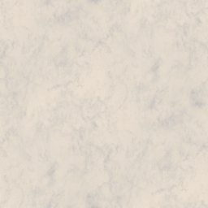
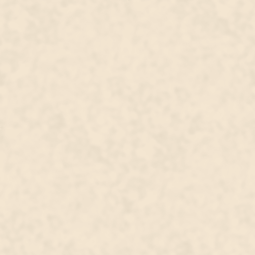
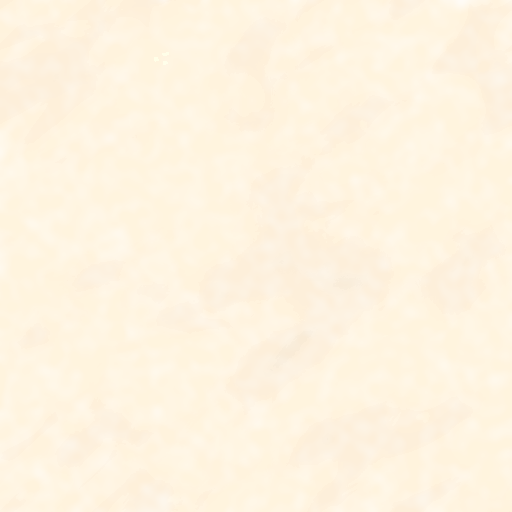
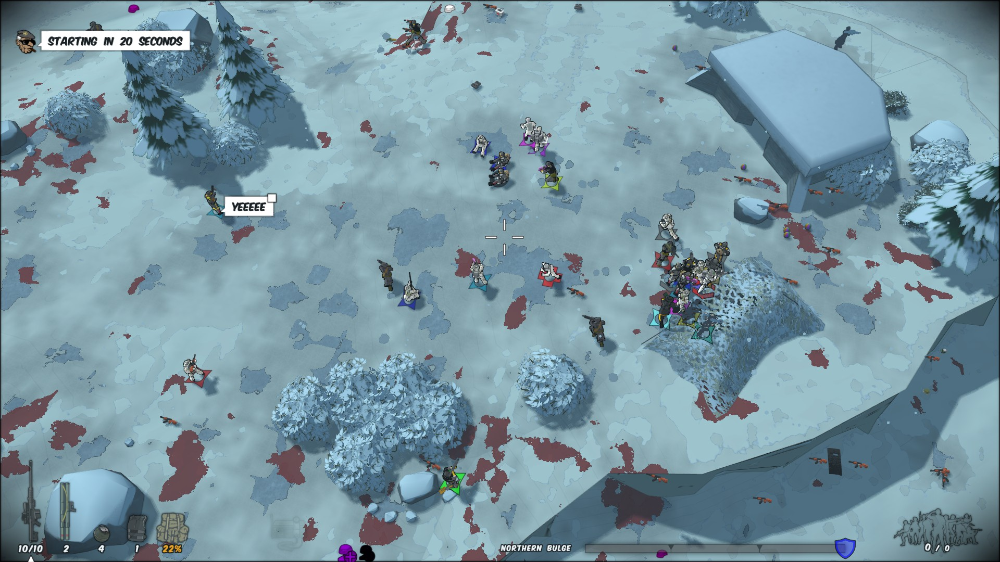

# How to Make Tropical Blizzard less retina-burn blue

Works in multiplayer Invasion! 

1. Right-click Running with Rifles in your Steam Library list and select Manage > Browse local files. This will open the directory where Steam installed the game on your machine.

2. Navigate from this folder down into the `media/packages/vanilla.winter/maps/map8_2 `directory.

3. Insert the (attached) recoloured `ice.png`, `snow.png`, and `splat_effect_snow.png` textures into this map folder.

4. Celebrate the newfound longevity of your vision and upvote this guide!

The attached PNGs are included as examples that you can use "out-of-the-box" - the colour temperature of the original PNGs was red-shifted using [GIMP](https://www.gimp.org/).

### ice

### snow

### splat effect snow

### Example of the example textures in use

:::tip
You can find the original PNGs in `vanilla.winter\textures` and make your own adjustments if you'd like to.
Note that, if you modify the textures in the `vanilla.winter\textures` folder, they will be used in all of the winter maps (Fridge Valley, Tropical Blizzard, and Frozen Canyon) - this may be preferable to you, this guide is in-part intended to show that files within a map folder take precedence over (and can thus overwrite) files within a wider package.
:::

:::info

Author: warbong

https://discord.com/channels/181119538664964097/1404976804229288016

:::