---
tags:
  - Resources
  - radio calls
---
***Radio calls*** are powerful game elements that can turn the tide of a battle. They have to be used wisely as they can require a significant amount of resource points and can also provide a lot of collateral damage if not timed properly.

Press and hold the radio calls button ( `H` by default) to bring up your radio calls menu. Select a call by clicking on it or by pressing the number right next to the call symbol. Whatever you selected will then be dropped approximately where you had your crosshairs when you pressed the radio calls button.

Keep in mind that every radio call has a delay thus doesn't happen instantly.

Some maps has an ***anti-air emplacement*** that prevents the player from calling in paratroopers, airdrops or close air support, allowing only mortar strikes and artillery. The structure has map-wide range and needs to be destroyed in order to unlock the rest of the radio calls. The emplacement will then remain in its destroyed state indefinitely.

Enemy bases may also have a ***radio jammer*** that prevents the player and friendly AIs from using the radio. Unlike the anti-air, the jammer only affects the base itself, but is much more devastating since it completely strips the player off their radio ability.

:::note
You have to be at least Corporal (1000 XP) to get a radio device (will be added automatically to your HUD).
:::

### Veterans Pack DLC
Players with the ***Veterans Pack DLC*** will have exclusive access to the light anti-armor ***VFS Call***, though any players can enter the VFS afterwards, regardless of whether they own the DLC.

DLC owners can also toggle on/off a ***Skin Pack*** option for their vehicles (applies to Humvee, Buggy, Main Battle Tank), applying a unique map-dependent camo pattern/decals to vehicles that prevents non-DLC owners from entering them.

### List of calls
| Image | Name | Description | Required XP | Price (RP) | Delay (s) |
|-------|------|-------------|-------------|------------|-----------|
| 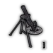 | Mortar strike (1x8) | Fires one salvo of eight rounds. | 1000 | 100 | 8 |
|  | Cluster bombing | Drops 2 cluster bomb containers that unload dozens of smaller bomblets. | 3000 | 200 | 8 |
|  | 4 paratroopers | Drops four paratroopers, one will always have a medkit. | 2000 | 120 | 11 |
| 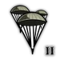 | 8 paratroopers | Drops eight paratroopers, two will always have a medkit. | 4000 | 200 | 11 |
| 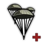 | 4 elite paratroopers | Drops 4 elite paratroopers. Three are armed with the faction's Assault SMG, while the final is a medic armed with a taser and trauma kit. All are equipped with vests. | 4000 | 300 | 11 |
| 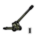 | Artillery strike (2x16) | Fires two salvos of 16 rounds each. | 4000 | 300 | 8 |
|  | Artillery strike (5x16) | Fires five salvos of 16 rounds each. | 7000 | 700 | 8 |
|  | Sandbags drop | Drops 2 sandbags. | 1000 | 40 | 2 |
| 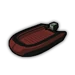 | Rubber boat drop | Drops a rubber boat. | 3000 | 70 | 15 |
| 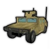 | Spawn humvee | Drops a combat Humvee equipped with an automatic grenade launcher. | 4000 | 400 | 17 |
| 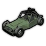 | Spawn Buggy | Drops a fast Buggy combat vehicle equipped with an MG. | 3000 | 300 | 17 |
| 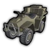 | Spawn Supply Quad | Drops a Supply Quad with a limited armory. | 5000 | 350 | 18 |
| 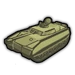 | Spawn tank | Drops a faction-specific Main Battle Tank. | 5000 | 1000 | 18 |
| 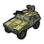 | Spawn VFS **(exclusive to Veterans DLC owners)** | Drops a lightly armored assault vehicle equipped with an MG and anti-tank TOW. | 5000 | 450 | 17 |
|  | A-10 gun run | Calls in an A10 Warthog air strike. | 6000 | 220 | 8 |
| 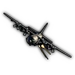 | Gunship run | Calls in an AC130 Gunship that constantly bombards enemies within a 30m radius, does not target friendly units. (Only available in Campaign and Online Invasion). | 10000 | 1000 | 18 |
