---
tags:
  - Resources
  - Ranks
  - Scoring
---

Similar to most RPG, you gain experience while killing enemies. The higher the rank of the enemy, the more XP you gain.
Performing kill combos will give you an XP boost. You also lose some XP by getting killed / committing suicide or team killing.

## Scoring
Score is a statistic for online play. It is a simple Kills – Deaths calculation and gives you a general idea of performance. If a server has Persistent Statistics, then your score along with the other stats shown by pressing the F1-key (default) will be saved over multiple matches and logins. None of these statistics have any influence on gameplay.

## Experience

***To view your XP/rank, hover over your character***. The number at the bottom shows your experience points (XP) and it starts from 0 at the beginning. On the right side is shown your current rank. You can also check your rank by keeping the F key (by default) pressed and right beyond your soldier your XP and RP is shown.

Your rank will dictate a few things:

- Capacity of equipment such as grenades, rockets, deployable weapons, etc.

- Ability to use certain weapons/equipment that are rank-restricted.

- Ability to use radio calls.

- Number of maximum squadmates possible (one per 1000 XP, up to a maximum of 10).

- Ability to take command of vehicles from allied AI or players. When your rank is greater than the rank of a soldier driving a vehicle, you can force the soldier to disembark by getting in the driver's side.

- The higher your rank, the better you retain AI soldiers in your squad and have higher priority in filling your squad, in regards to other human players.

The XP requirements for each rank can be referred in the table below

:::note
When just a weapon category is listed (like Assault rifles, Machineguns), it includes only the basic faction weaponry.
:::

| XP        | Rank | Radio calls | Weapons | Equipment | Throwables |
|-----------|------|-------------|---------|-----------|------------|
| 0         |  Private |  | Assault rifles Shotguns | 2x Medikit 4x Wrench Riot shield | 2 hand/stun grenades |
| 250       |      |             | M240 machinegun | Deployable cover Binoculars |  |
| 500       |  Private 1st Class |  | Machineguns 1x Faction Rocket Launcher |  | 2 impact grenades |
| 750       |      |             | Pistols |  |  |
| 1000      |  Corporal | 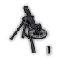 Mortar strike (1x8) 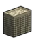 Sandbag drop | Suppressed SMGs Machine Pistols Desert Eagle pistol FAMAS G1 | Vest Type II Vest Type III Camouflage suit | 1 C4 1 Claymore mine |
| 1500      |      |             | Sniper rifles L85A2 SG 552 Pepperdust shotgun Beretta 93R 1x Javelin | Deployable MG | 1 Flare (Spawn Point) |
| 2000      |  Sergeant | 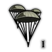 4 paratroops | AKS-74U Stoner LMG 2x Faction Rocket Launcher 1x SMAW | Deployable minigun Deployable mortar 2x Deployable cover | 3 hand/stun/impact grenades 2 C4's 2 Claymore mines |
| 2500      |      |             | Single-shot Grenade Launchers UTS-15 shotgun APR sniper rifle MGL Flasher 2x Javelin |  |  |
| 3000      |  Staff Sergeant | 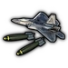 Cluster bombing 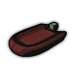 Boat drop 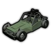 Buggy drop | P90 XM-8 F2000 AA-12 shotgun 44 Magnum Sawn-Off Shotgun M712 machine pistol | Deployable GL Black Ops Vest | 3 C4's 2 Flares (Spawn Point) |
| 4000      |  Staff Sergeant 1st Class | 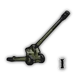 Artillery strike (2x16) 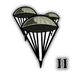 8 Paratroops  4 Elite Paratroops 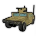 Humvee airdrop | Steyr AUG Benelli M4 shotgun Neostead 2000 shotgun Jackhammer shotgun XM-25 GL MP7 machine pistol MK23 SOCOM 2x SMAW | 2x Deployable Hornet | 4 hand/stun/impact grenades |
| 5000      |      | 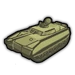 Tank airdrop 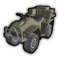 Supply Quad airdrop 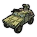 VFS airdrop (exclusive to Veterans Pack owners) | Assault Rifle w/ GL Stoner 62 Pecheneg Bullpup WB-II Microgun KAC Chain SAW Barrett M-107 KRISS Vector 3x Javelin | Deployable TOW missile nest 2x Deployable MG 2x Deployable minigun 2x Deployable GL EOD armor |  |
| 6000      |  2nd Lieutenant | 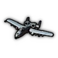 A-10 gun run | MG-42 SCAR SSR VSS Vintorez Lahti L-39 PAW-20 1x M202 flash |  | 3 Claymore mines |
| 7000      |      | 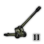 Artillery strike (5x16) | Milkor MGL 3x SMAW |  |  |
| 8000      |  Lieutenant |  | M60 machinegun 2x M202 flash |  |  |
| 10,000    |  Captain | 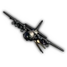 Gunship run | 3x M202 flash | 2x Deployable TOW missile nest Exo Suit |  |
| 12,000    |  Major |  |  |  |  |
| 14,000    |  Lieutenant Colonel |  |  |  |  |
| 20,000    | 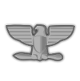 Colonel |  |  |  |  |
| 50,000    |  brigadier General |  |  |  |  |
| 100,000   |  Major General |  |  |  |  |
| 200,000   |  Lieutenant General |  |  |  |  |
| 500,000   |  General |  |  |  |  |
| 1,000,000 |  General of the Army |  |  | Player model has a better outfit. |  |
| 2,000,000 |  General of the Army (II) |  |  | Player model has a sweet outfit. |  |
| 3,000,000 |  General of the Army (III) |  |  |  |  |
| 4,000,000 |  General of the Army (IV) |  |  | Player model has a nicer outfit. |  |
| 5,000,000 |  General of the Army (V) |  |  | Player model has an even sweeter outfit. |  |
| 6,000,000 |  Field Marshal |  |  | Player model has a fancy outfit. |  |
| 8,000,000 |  Vice President |  |  | Player model has a decently fancier outfit. |  |
| 10,000,000|  President (bald) |  |  | Player model has the fanciest outfit. |  |
