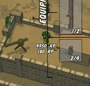

---
tags:
  - Resources
  - RP or Resource points
---

RP or "Resource Points" are points you receive during the game while completing different tasks. Those RP can be used to buy different equipments at an armory or to use different radio calls. 

You can see how much RP you have by keeping the inventory key (Default `F` ) pressed to call the inventory.

It is displayed right below the XP information.

List of things that give you RP:

- capturing a base
- spotting an enemy vehicle
- selling valuables at an armory. Those are dropped with different commonness from the enemy soldiers and have also different values
- selling rare weapons (those can either be used or sold). Those are either dropped by mini-bosses or found in special crates (metallic boxes)
- destroying enemy vehicles.
- destroying mission targets such as comms truck, radar tower, prisoner bus, radio jamming tower, water tower, fuel tanks, - mortars, ammunition crates, AA emplacement results in a good RP reward
- Stealing the Cargo Truck of the enemy team and bringing it back to one of your armories
- being promoted to a higher military rank