# Weapons and equipment

| Image | Name | Type | Faction | Price (RP) | Magazine size | Fire rate | Accuracy factor | Recoil | Recoil recovery | Kill probability | Fall-off Start(m) | Max range(m) | Bullet Speed | Speed mod(%) | Commonness |
| --- | --- | --- | --- | --- | --- | --- | --- | --- | --- | --- | --- | --- | --- | --- | --- |
| 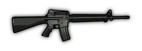 | M16A4 | Assault rifle, full-auto | Greenbelts/ Unlockable | 2 | 30 | 531 | 1 | 0.34 | 1.4 | 0.5 | 34 | 67 | 100 | -3.6 | 0.2 |
| 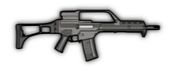 | G36 | Assault rifle, full-auto | Graycollars/ Unlockable | 2 | 30 | 545 | 1 | 0.36 | 1.38 | 0.5 | 35 | 70 | 100 | -1.8 | 0.2 |
| 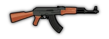 | AK47 | Assault rifle, full-auto | Brownpants/ Unlockable | 2 | 30 | 488 | 1 | 0.4 | 1.2 | 0.55 | 33 | 68 | 100 | -2 | 0.2 |
| 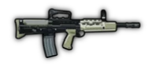 | L85A2 | Bullpup assault rifle, 3-round burst | Greenbelts/ Unlockable | 8 | 30 | 632 | 1 | 0.35 | 1.4 | 0.55 | 36 | 66 | 100 | -3 | 0.0003 |
| 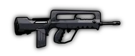 | FAMAS G1 | Bullpup assault rifle, 3-round burst | Graycollars/ Unlockable | 8 | 25 | 750 | 1 | 0.32 | 1.4 | 0.55 | 37 | 65 | 100 | -2 | 0.0003 |
|  | SG 552 | Assault rifle, semi-auto | Brownpants/ Unlockable | 10 | 30 | 600 | 1 | 0.32 | 1.4 | 0.57 | 33 | 68 | 100 | 0 | 0.0003 |
| 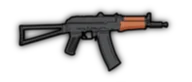 | AKS-74U | Assault rifle, full-auto | Rare | 80 | 30 | 612 | 1 | 0.6 | 2.5 | 0.6 | 38 | 52 | 100 | 0 | 0.0005(and Ice Cream Van (200 RP), Secret crate) |
| 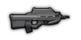 | F2000 | Bullpup assault rifle, full-auto | Rare | 80 | 30 | 545 | 1 | 0.25 | 0.8 | 0.58 | 45 | 75 | 100 | -4 | 0.0006(and Ice Cream Van (200 RP)) |
|  | XM-8 | Assault rifle, full-auto | Rare | 80 | 30 | 545 | 1 | 0.28 | 1.0 | 0.55 | 42 | 75 | 100 | -4 | 0.0004(and Ice Cream Van (200 RP)) |
| 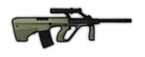 | Steyr AUG | Bullpup assault rifle, full-auto, 1.3x scope, high-velocity | Rare | 180 | 42 | 488 | 1 | 0.36 | 1.0 | 0.55 | 54 | 90 | 120 | -4 | 0.0002(and Lottery) |
| 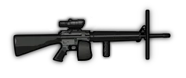 | M16A4 - Shield and Scope | Assault rifle, full-auto, 1.2x scope, small ballistic shield, crouch/prone fire | Gift Box | 90 | 100 | 531 | 1 | 0.3 | 1.4 | 0.5 | 34 | 67 | 100 | -8 | 0(Community Box 2, Lottery) |
| 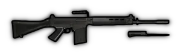 | FN FAL | Battle rifle, full-auto, optional bayonet which extends melee range to 3m but reduces standing/crouching accuracy | Gift Box | 420 | 20 | 531 | 1 | 0.4 | 1.1 | 0.58 | 42 | 75 | 100 | -3.6 | 0(Community Box 2, Lottery) |
| 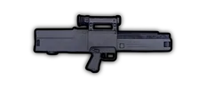 | G11 | Bullpup assault rifle, full-auto, 1.2x scope, alternate 3-round burst mode (stats in parenthesis) | Gift Box | 440 | 45 | 462(3000) | 1 | 0.3(0.1) | 1.4(0.4) | 0.53 | 40 | 64 | 100 | -2 | 0(Community Box 4, Lottery) |
| 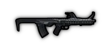 | TKB-059 | Bullpup assault rifle, full-auto, triple barrel | Gift Box | 630 | 30 | 488 | 0.96 | 0.5 | 1.1 | 0.5x3 | 25 | 58 | 100 | -3 | 0(Community Box 4, Lottery) |
| 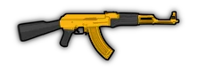 | Golden AK47 | Assault rifle, full-auto, shiny | Gift Box | 3000 | 30 | 488 | 1 | 0.4 | 1.2 | 0.55(and also deals 0.5 after each damaging shot) | 36 | 75 | 110 | -10 | 0(Community Box 4, Golden egg, Lottery) |
| 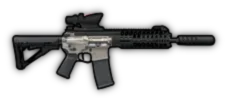 | P416 | Assault rifle, full-auto, 1.1x scope, suppressed | Very Rare /Gift Box | 416 | 30 | 531 | 1 | 0.28 | 1.0 | 0.52 | 31.5 | 65.1 | 105 | -4 | 7% / 15% drop chance from Off Duty Veteran (normal kill / melee kill) (Summer Event)(and Community Box 5, Lottery) |
| 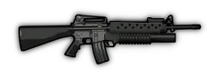 | M16A4 w/ M203 GL | Assault rifle, full-auto. Alternate single-shot grenade launcher, 55 damage in 4.5m radius, same ballistics and reload as M79. | Greenbelts/Gift Box | 250 | 30 | 531 | 0.95 | 0.29 | 1.4 | 0.5(Explosive 55) | 34 | 67 | 100 | -13.6 | 3.125% drop chance from Ranger(and Community Box 6, Lottery) |
| 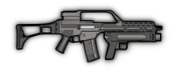 | G36 w/ AG36 GL | Assault rifle, full-auto. Alternate single-shot grenade launcher, 50 damage in 4.4m radius, same ballistics as M79 and same reload as GL06. | Graycollars/Gift Box | 250 | 30 | 545 | 0.95 | 0.31 | 1.38 | 0.5(Explosive 50) | 35 | 70 | 100 | -11.8 | 3.125% drop chance from Ranger(and Community Box 6, Lottery) |
| 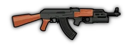 | AK47 w/ GP25 GL | Assault rifle, full-auto. Alternate single-shot grenade launcher, 65 damage in 5.7m radius, same ballistics and reload as RGM-40. | Brownpants/Gift Box | 250 | 30 | 488 | 0.95 | 0.35 | 1.2 | 0.55(Explosive 65) | 33 | 68 | 100 | -12 | 3.125% drop chance from Ranger(and Community Box 6, Lottery) |
| 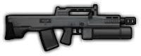 | ASh-12.7 | Bullpup assault rifle, full-auto, alternate semi-auto suppressed flashbang launcher inflicting stun in a 3.5m radius (flashbang launcher stats in parenthesis) | Gift Box | 721 | 20(3) | 545(120) | 1(0.9) | 2.0(1.5) | 1.5(0.5) | 0.75 | 40 | 60 | 100(60) | -10 | 0(Community Box 6, Lottery) |
| 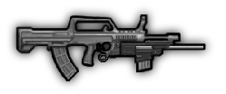 | QBZ-95 | Bullpup assault rifle, full-auto, alternate underbarrel full-auto shotgun (shotgun stats in paren... | Gift Box | 280 | 30(4) | 500(333) | 0.95(0.75) | 0.42(1.3) | 1.3(0.8) | 0.53(0.62x4) | 35.2(19.6) | 59.9(29.8) | 95(85) | -8 | 0(Community Box 3, Pumpkin Box, Lottery) |
| 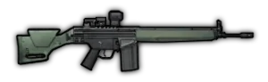 | G3A3 | Battle rifle, full-auto, alternate semi-auto mode with 1.35x scope (semi-auto stats in parenthesis) | Gift Box | 490 | 20 | 500(300) | 1 | 0.5(0.6) | 1.8 | 0.6 | 40.3 | 89.7 | 115 | -4 | 0(Community Box 1, Pumpkin Box, Lottery) |
| 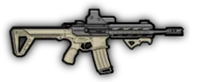 | Gilboa DBR | Assault rifle, full-auto, double barrel | Gift Box | 150 | 30 | 400 | 1 | 0.27 | 1.2 | 0.5x2 | 38 | 52 | 100 | -5 | 0(Community Box 7, Lottery) |
| 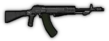 | AN-94 | Assault rifle, full-auto, alternate 2-round burst mode (2-round burst stats in parenthesis) | Gift Box | 250 | 45 | 588(1714) | 1 | 0.35(0.15) | 1.34(0.6) | 0.5 | 32(38.4) | 69(82.8) | 100(120) | -3.2 | 0(Community Box 7, Lottery) |
| 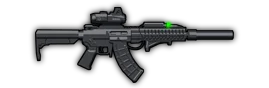 | MK47 Mutant | Assault rifle, full-auto, 1.1x scope, suppressed, high-velocity | Very Rare | 470 | 30 | 612 | 1 | 0.42 | 1.8 | 0.58 | 39.6 | 63.8 | 110 | -4 | 7% / 15% drop chance from Off Duty Veteran (normal kill / melee kill) (Summer Event) |
| 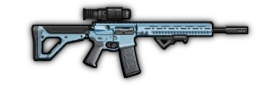 | AR15 | Assault rifle, full-auto, 1.1x scope,alternate thermal sight which reduces accuracy factor to 0.8... | Gift Box | 365 | 30 | 531 | 0.98 (0.85/1.1) | 0.36 | 1.38 | 0.55 | 37.4 | 73.7 | 110 | -3.6 | 0(Cooler Box 1, Lottery) |
|  | OTs-14 w/ GP25 GL | Bullpup assault rifle, full-auto,alternate single-shot grenade launcher which has projectile spee... | Gift Box | 265 | 30 | 750 | 1 | 0.6 | 3.0 | 0.6 | 38 | 52 | 100 | -8 | 0(Cooler Box 2, Lottery) |
| 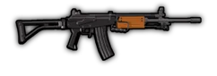 | Galil ARM | Assault rifle, full-auto,alternate bipod mode (stats in parentheses) which has low standing and c... | Gift Box | 290 | 35 | 652 | 0.95(0.83) | 0.38(0.45) | 1.2(2.0) | 0.6(0.62) | 32.4(37.8) | 75.6 | 108 | -9.2 (-13) | 0(Pumpkin Box 2, Lottery) |
| 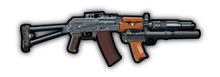 | AKS w/ Tishina GL | Assault rifle, full-auto, suppressed, 1.0 prone accuracy.Alternate single-shot grenade launcher, ... | Gift Box | 380 | 30 | 612 | 1 | 0.45 | 1.8 | 0.56(Explosive 65) | 30 | 45 | 100 | -8 | 0(Easter egg #1, Golden egg) |
| 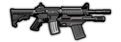 | M4 w/ M26 Frag | Assault rifle, 3-round burst.Alternate underbarrel bolt-action shotgun, explosive shells, 15 dama... | Gift Box | 360 | 30(5) | 600(63) | 1(0.9) | 0.33(0.27) | 1.4(1.2) | 0.54(Explosive 15) | 35(75) | 65.9(75) | 103(75) | -12 | 0(Easter egg #3, Golden egg) |
| 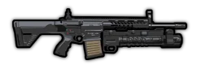 | MPT-76 w/ AK-40 GL | Assault rifle, full-auto, 1.0 prone accuracy.Alternate single-shot grenade launcher, 140 damage i... | Gift Box | 415 | 25 | 454 | 1 | 0.48 | 2.8 | 0.58(Explosive 140) | 39.6 | 71.5 | 110 | -12 | 0(Easter egg #4, Golden egg) |
| 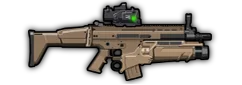 | SCAR L w/ MK13 GL | Assault rifle, full-auto, 0.95x zoom, fixed thermal sight that increases accuracy factor to 1.1 a... | Gift Box | 450 | 30 | 545 | 0.95 | 0.58 | 2.8 | 0.53(Explosive 1x3) | 39.9 | 71.4 | 105 | -12 | 0(Easter egg #4, Golden egg) |
| 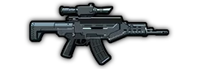 | QTS-11 | Assault rifle with integrated GL, full-auto, 1.1x scope, 1.0 prone accuracy.Alternate single-shot... | Gift Box | 800 | 30 | 521 | 1 | 0.32 | 1.4 | 0.54(Explosive 45) | 33.6 | 66.2 | 105 | -14 | 0(Easter egg #1, Easter egg #3, Golden egg) |
| 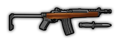 | Ruger AC556 | Carbine, full-auto, reduced maximum bullet spread,optional bayonet with 3.6m melee range (stats i... | Gift Box | 490 | 30 | 619 | 1(0.85) | 0.6(1.1) | 2.0(1.8) | 0.52 | 42 | 60 | 100 | 0(+11) | 0(Cooler Box 3) |
| 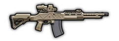 | HCAR | Battle rifle, full-auto, 1.33x zoom, 1.0 crouching accuracy | Gift Box | 590 | 30 | 343 | 1 | 0.8 | 2.2 | 0.58(and also deals 0.3 after each damaging shot) | 69 | 99 | 132 | -8 | 0(Cooler Box 3) |
| 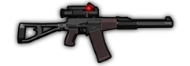 | ASM VAL | Assault rifle, full-auto, 1.1x zoom, suppressed | Very Rare | 470 | 30 | 750 | 1 | 0.42 | 1.8 | 0.6 | 36.1 | 49.9 | 86 | -4 | 7% / 15% drop chance from Off Duty Veteran (normal kill / melee kill) (Summer Event) |

## 表格 2

| Image | Name | Type | Faction | Price (RP) | Magazine size | Fire rate | Accuracy factor | Recoil | Recoil recovery | Kill probability | Fall-off Start(m) | Max range(m) | Bullet Speed | Speed modifier(%) | Commonness |
| --- | --- | --- | --- | --- | --- | --- | --- | --- | --- | --- | --- | --- | --- | --- | --- |
| 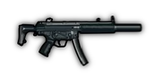 | MP5SD | Submachine gun, suppressed | Greenbelts/ Unlockable | 4 | 30 | 652 | 1 | 0.7 | 2.2 | 0.4 | 24 | 40 | 105 | 0 | 0.00001 |
| 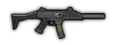 | Scorpion Evo III | Submachine gun, suppressed | Graycollars/ Unlockable | 4 | 30 | 800 | 1 | 0.68 | 2 | 0.36 | 24 | 36 | 100 | 0 | 0.00001 |
| 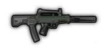 | QCW-05 | Bullpup submachine gun, suppressed | Brownpants/ Unlockable | 4 | 50 | 706 | 1 | 0.62 | 2 | 0.35 | 23 | 37 | 100 | 0 | 0 |
| 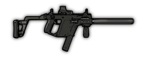 | KRISS Vector | Submachine gun, suppressed | Rare | 250 | 25 | 845 | 1 | 0.82 | 3 | 0.42 | 28.6 | 44 | 110 | 0 | 0.0001(and Lottery, Secret crate) |
| 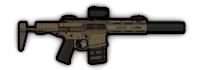 | AAC Honey Badger | Personal Defense Weapon,3-round burst, suppressed | Gift Box | 390 | 30 | 800 | 1 | 0.15 | 0.6 | 0.45 | 35.7 | 54.6 | 105 | -2 | 0(Purple Box, Titan Box, Lottery, Secret crate) |
|  | Golden MP5SD | Submachine gun, suppressed, shiny | Gift Box | 2500 | 30 | 652 | 1 | 0.7 | 2.2 | 0.4 | 25.3 | 41.8 | 110 | -6 | 0(Community Box 6, Golden egg, Lottery) |

## 表格 3

| Image | Name | Type | Faction | Price (RP) | Magazine size | Fire rate | Accuracy factor | Recoil | Recoil recovery | Kill probability | Fall-off Start(m) | Max range(m) | Bullet Speed | Speed mod(%) | Commonness |
| --- | --- | --- | --- | --- | --- | --- | --- | --- | --- | --- | --- | --- | --- | --- | --- |
|  | P90 | Personal Defense Weapon | Rare | 100 | 50 | 857 | 1 | 0.58 | 3 | 0.57 | 32 | 44 | 100 | 0 | 0.0005(and Secret crate) |
| 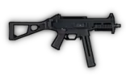 | UMP40 | Submachine gun | Greenbelts/Gift Box | 10 | 30 | 667 | 1 | 0.8 | 2.4 | 0.5 | 33 | 43 | 100 | 0 | 10% drop chance from elite paratrooper(and Community Box 3, Lottery) |
| 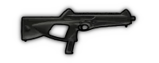 | MX4 Storm | Submachine gun | Graycollars/Gift Box | 10 | 30 | 952 | 1 | 0.5 | 2 | 0.5 | 35 | 41 | 100 | 0 | 10% drop chance from elite paratrooper(and Community Box 3, Lottery) |
| 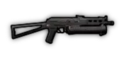 | PP-19 Bizon | Submachine gun | Brownpants/Gift Box | 10 | 64 | 706 | 1 | 0.6 | 2.2 | 0.5 | 28 | 41 | 100 | 0 | 10% drop chance from elite paratrooper(and Community Box 3, Lottery) |
| 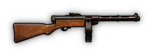 | KP-31 Suomi | Submachine gun, accurate while walking | Gift Box | 300 | 71 | 750 | 0.9 | 0.36 | 3 | 0.5 | 30 | 45 | 100 | 0 | 0(Community Box 5, Lottery) |
| 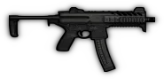 | MPX | Submachine gun,optional magazine with hollow point bullets (stats in parenthesis) | Gift Box | 300 | 30 | 822 | 1 | 0.33(0.4) | 2.5 | 0.5(0.5, and also deals 1.6 after each damaging shot) | 29.4(28) | 37.8(36) | 105(100) | 0 | 0(Community Box 7, Lottery) |
| 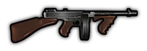 | Tommy Gun | Submachine gun,accurate while walking.Gives mafia gangster skin over Vest II. | Gift Box | 200 | 50 | 727 | 0.9 | 0.36 | 3 | 0.52 | 31.68 | 54.72 | 96 | -7.5 | 0(Pumpkin Box 2, Lottery) |

## 表格 4

| Image | Name | Type | Faction | Price (RP) | Magazine size | Fire rate | Accuracy factor | Recoil | Recoil recovery | Kill probability | Fall-off Start(m) | Max range(m) | Bullet Speed | Speed modifier(%) | Commonness |
| --- | --- | --- | --- | --- | --- | --- | --- | --- | --- | --- | --- | --- | --- | --- | --- |
| 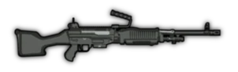 | M240 | Medium machine gun* | Greenbelts/ Unlockable | 2 | 100 | 723 | 0.62 | 0.8 | 0.8 | 0.67 | 35 | 70 | 100 | -10 | 0.05 |
| 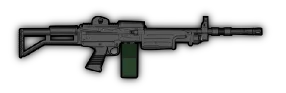 | IMI Negev | Light machine gun* | Graycollars/ Unlockable | 2 | 100 | 779 | 0.63 | 0.8 | 0.8 | 0.65 | 40.7 | 78.1 | 110 | -8 | 0.05 |
|  | PKM | Medium machine gun* | Brownpants/ Unlockable | 2 | 150 | 652 | 0.56 | 0.8 | 0.9 | 0.63 | 33 | 66.5 | 95 | -6 | 0.05 |
| 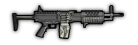 | Stoner LMG | Light machine gun | Rare | 160 | 80 | 600 | 0.75 | 0.8 | 0.9 | 0.6 | 35 | 75 | 100 | -7 | 0.0003(and Secret crate) |
| 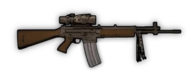 | Stoner 62 | Light machine gun,high accuracy when prone or behind cover,1.4x zoom | Rare | 450 | 30 | 652 | 0.94 | 0.3 | 1.4 | 0.7 | 52.8 | 77 | 110 | -6 | 0.00002(and Lottery, Secret crate) |
| 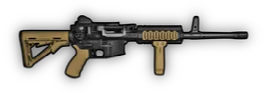 | ARES Shrike | Light machine gun, crouch/prone fire,6 round burst / semi-auto | Gift Box | 300 | 60 | 705(400) | 0.9 | 0.1 | 0.4 | 0.57 | 38 | 70 | 100 | -7 | 0(Blue Box, Purple Box, Titan Box, Lottery, Secret crate) |
| 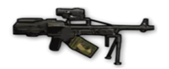 | Pecheneg Bullpup | Bullpup machine gun*, 1.2x zoom | Rare | 430 | 150 | 545 | 0.82 | 0.7 | 1.4 | 0.7 | 42 | 90 | 100 | -8 | 0.00005(and Lottery) |
|  | KAC Chain SAW | Light machine gun, full-auto, suppressed,gives a special skin over Exo Suit | Rare | 550 | 200 | 1200 | 0.7 | 0.015 | 0.18 | 0.46 | 30 | 72 | 100 | -42 | 0.00005(and Lottery, Secret crate) |
|  | M60 | Medium machine gun | Gift Box | 700 | 100 | 600 | 0.725 | 2.5 | 1.15 | 0.71 | 35 | 65 | 100 | -11 | 0(Purple Box, Titan Box, Lottery, Secret crate) |
|  | WB-II Microgun | Rotary machine gun,gives a special skin over Exo Suit | Rare | 800 | 1000 | 1875 | 0.75 | 0.01 | 0.15 | 0.5 | 30 | 72 | 120 | -45 | 0.00004(and Lottery) |
|  | MG-42 | Machine gun* | Very rare | 1200 | 150 | 1200 | 0.7 | 0.016 | 0.2 | 0.62 | 42 | 90 | 120 | -12 | 0.00001(and Lottery, Secret crate) |
|  | RPD | Light machine gun.Optional bipod mode*with reduced maximum bullet spread(stats in parenthesis). | Gift Box | 610 | 100 | 652 | 0.7 | 0.8(0.4) | 0.82(1.3) | 0.6(0.62) | 30(35) | 70 | 100 | -9.2(-13) | 0(Community Box 6, Lottery) |
|  | Ultimax 100 | Negative recoil machine gun, optional assault rifle mode (AR mode stats in parenthesis) | Gift Box | 800 | 100(30) | 667(600) | 0.8(0.85) | -0.15(-0.2) | -1.2(-1.35) | 0.6 | 51(52) | 63.7(65) | 98(100) | -10(-7) | 0(Community Box 6, Lottery) |
|  | DPM | Light machine gun.Optional shield mode, crouch/prone fire (shield stats in parenthesis). | Gift Box | 280 | 47 | 600 | 0.78 | 1(0.8) | 2.4 | 0.65 | 36.3 | 70.4 | 110 | -10(-30) | 0(Pumpkin Box, Lottery) |
|  | M249 | Light machine gun, crouch/prone fire, 1.1x scope, optional suppressor (stats in parenthesis) | Gift Box | 249 | 120 | 779 | 0.85 | 0.65 | 0.85 | 0.58(0.53) | 35(30) | 70(70) | 100 | -6.5 | 0(Cooler Box 1, Lottery) |
|  | RPK16 | Light machine gun.Optional Long Barrel mode: crouch/prone fire, good accuracy when prone or behin... | Gift Box | 216 | 96 | 706 | 0.9 | 0.55(0.15) | 0.9(0.7) | 0.55(0.65) | 40(50) | 70(70) | 100 | -6(-12) | 0(Cooler Box 2, Lottery) |
|  | QJZ89 HMG | Heavy machine gun* with 1.1x scope | Gift Box | 399 | 200 | 600 | 0.85 | 0.06 | 0.4 | 0.88 | 52.8 | 77 | 110 | -45 | 0(Cooler Box 1, Lottery) |
|  | Lewis Gun | Machine gun, can overheat.Gives mafia gangster skin over Vest II. | Gift Box | 700 | 97 | 500 | 0.8 | 0.03 | 0.15 | 0.65 | 51 | 80 | 100 | -20 | 0(Pumpkin Box 2, Lottery) |

## 表格 5

| Image | Name | Type | Faction | Price (RP) | Magazine size | Fire rate | Accuracy factor | Recoil | Recoil recovery | Kill probability | Fall-off Start(m) | Max range(m) | Bullet Speed | Speed modifier(%) | Commonness |
| --- | --- | --- | --- | --- | --- | --- | --- | --- | --- | --- | --- | --- | --- | --- | --- |
|  | Mossberg 500 | Shotgun, pump-action | Greenbelts/ Unlockable | 2 | 8 | 80 | 0.75 | 2 | 0.9 | 0.6x5 | 21.5 | 25.8 | 86 | 0 | 0.01 |
|  | SPAS-12 | Shotgun, pump-action | Graycollars/ Unlockable | 2 | 8 | 80 | 0.68 | 2 | 0.9 | 0.62x6 | 21.6 | 26.1 | 90 | -2 | 0.01 |
|  | QBS-09 | Shotgun, semi-auto | Brownpants/ Unlockable | 2 | 10 | 150 | 0.74 | 2 | 0.9 | 0.59x5 | 19.8 | 27.5 | 86 | 0 | 0.01 |
|  | UTS-15 | Bullpup pump-action shotgun,higher fire rate when prone | Rare | 20 | 14 | 80 / 133 | 0.75 | 2 | 0.9 | 0.65x6 | 23 | 27.5 | 100 | -3 | 0.004 |
|  | Neostead 2000 | Bullpup pump-action shotgun | Rare | 100 | 10 | 80 | 0.8 | 2 | 0.9 | 0.7x4 | 31.5 | 36 | 90 | 0 | 0.0005(and Lottery, Secret crate) |
|  | Pepperdust | Pump-action shotgun,stun only, suppressed | Rare | 100 | 15 | 80 | 0.8 | 2 | 0.6 | Stun 0.65x10 | 22.4 | 32 | 80 | +6 | 0.0006 |
|  | Benelli M4 | Shotgun, semi-auto | Rare | 200 | 12 | 180 | 0.8 | 2 | 0.9 | 0.65x5 | 23.5 | 30.1 | 94 | 0 | 0.0006(and Secret crate) |
|  | Benelli M4suppressed | Shotgun, semi-auto, suppressed (swap from Benelli M4) | Rare | 200 | 12 | 180 | 0.78 | 2 | 0.8 | 0.65x5 | 19.8 | 34.2 | 90 | 0 | 0.0001 |
|  | AA-12 | Assault shotgun, full-auto,full magazine reload | Rare | 150 | 20 | 240 | 0.9 | 0.6 | 0.6 | 0.5x3 | 28.5 | 38 | 95 | 0 | 0.0002(and Secret crate) |
|  | Jackhammer | Shotgun, full-auto,full magazine reload | Rare | 350 | 10 | 240 | 0.9 | 0.7 | 1.4 | 0.6x3 | 31.4 | 49 | 98 | -4 | 0.0001(and Lottery, Secret crate) |
|  | TTI-Combat Shield | Pump-action shotgun,ballistic shield that blocks bullets,but doesn't have any explosive protection | Rare /Gift Box | 210 | 3 | 80 | 0.7 | 2 | 0.9 | 0.6x6 | 22.5 | 27 | 90 | -35(-32 for EOD AI) | 6.25% drop chance from EOD elite(and Community Box 2, Lottery) |
|  | KSxS-6 Hunter | Double-barreled shotgun,one shot contains 6 pellets.Alternate mode simply fires both barrels,laun... | Gift Box | 400 | 2 | 600 | 0.75 | 2 | 1 | 0.6x6(and also deals 1.0 after each damaging pellet) | 9 | 63 | 90 | -2 | 0(Community Box 6, Lottery) |
|  | KSG | Shotgun, pump-action, with 2 independent ammo tubes that have Buckshot and Slug rounds.Slugs work... | Gift Box | 280 | 7(7) | 80 / 133 | 0.75(1) | 2 | 0.9(1.5) | 0.65x5(Explosive 1x4) | 28(36) | 40(36) | 100(90) | -2 | 0(Cooler Box 1, Lottery) |
|  | KS-23 | Shotgun, 4 gauge, pump-action | Gift Box | 299 | 4 | 75 | 0.65 | 5 | 1.6 | 0.55x10 | 22.5 | 47.7 | 90 | -4 | 0(Cooler Box 2, Lottery) |
|  | GEN-12 RED | Shotgun, full-auto, 1.1x zoom, suppressed,full magazine reload | Very Rare | 470 | 10 | 462 | 0.82 | 0.8 | 1.3 | 0.51x4 | 20 | 45 | 100 | -4 | ?% drop chance when melee killing Bad Santa (Xmas event) |
|  | MAG-7 Dragon breath | Shotgun, pump-action, full magazine reload, dragon's breath ammo with 1.2m blast radius | Gift Box | 370 | 5 | 80 | 0.86 | 2.2 | 0.9 | Explosive 1x5 | 36 | 36 | 60 | -3 | 0(Cooler Box 3) |
|  | Benelli M3 - speed loader | Shotgun, pump-action, reloads 4 shells at a time | Gift Box | 450 | 8 | 80 | 0.76 | 2.0 | 0.9 | 0.61x6(and also deals 0.3 after each damaging pellet) | 28.8 | 33.6 | 96 | -1 | 0(Cooler Box 3) |

## 表格 6

| Image | Name | Type | Faction | Price (RP) | Magazine size | Fire rate | Accuracy factor | Recoil | Recoil recovery | Kill probability | Fall-off Start(m) | Max range(m) | Bullet Speed | Speed modifier(%) | Commonness |
| --- | --- | --- | --- | --- | --- | --- | --- | --- | --- | --- | --- | --- | --- | --- | --- |
|  | M24-A2 | Sniper rifle, bolt-action, 1.6x zoom | Greenbelts/ Unlockable | 4 | 10 | 40 | 1 | 3 | 0.55 | 1.0 | 99 | 144 | 180 | -7 | 0.01 |
|  | PSG-90 | Sniper rifle, bolt-action, 1.6x zoom | Graycollars/ Unlockable | 4 | 10 | 40 | 1 | 3 | 0.5 | 1.0 | 104.5 | 152 | 190 | -6 | 0.01 |
|  | Dragunov SVD | Sniper rifle, semi-auto, 1.45x zoom | Brownpants/ Unlockable | 4 | 10 | 80 | 1 | 3 | 0.87 | 0.9 | 101.8 | 129.5 | 185 | -4 | 0.01 |
|  | APR | Sniper rifle, bolt-action,1.45x zoom, suppressed | Lone Wolf/Unlockable | 25 | 5 | 40 | 1 | 3 | 0.7 | 0.85 | 78 | 120 | 160 | -9 | 0.00001(and Secret crate) |
|  | SCAR SSR | Designated marksman rifle, semi-auto,1.5x zoom | Rare | 320 | 20 | 120 | 1 | 2 | 1 | 1.0 | 81.6 | 136 | 170 | -8 | 0.0002(and Lottery) |
|  | VSS Vintorez | Designated marksman rifle, full-auto,1.3x zoom, suppressed | Rare | 200 | 20 | 300 | 0.9 | 3 | 3 | 0.8 | 78 | 120 | 120 | -5 | 0.0002(and Lottery) |
|  | Barrett M107 | Sniper rifle, semi-auto,crouch/prone fire, 1.65x zoom | Rare | 250 | 10 | 60 | 1 | 3 | 0.8 | 3.01 | 108 | 180 | 180 | -15 | 0.0001(and Lottery, Secret crate) |
|  | Lahti L-39 | Sniper rifle, semi-auto,explosive rounds, 1.35m radius,prone/cover fire only,can pierce through b... | Very rare | 1000 | 10 | 50 | 1 | 1 | 0.85 | Explosive 20x5 | - | - | 160 | -17 | 0.000005(and Lottery, Secret crate) |
|  | M711-LA Enforcer | Designated marksman rifle, lever action,reloads 1 round at a time, 1.3x zoom | Gift Box | 330 | 8 | 65 | 1 | 2.5 | 0.9 | 1.2 | 50.7 | 80.6 | 130 | -8 | 0(Community Box 3, Lottery) |
|  | M6 Lynx | Sniper rifle, semi-auto,1.65x zoom, suppressed | Lone Wolf /Gift Box | 300 | 5 | 60 | 1 | 3 | 0.9 | 1.5 | 90 | 150 | 150 | -16 | 0.000001(and Community Box 4, Lottery) |
|  | M14k | Semi-auto rifle,optional stim-pack mode, works like a fast reusable Medikit | Gift Box | 390 | 10 | 561 | 1 | 2.5 | 0.9 | 0.75 | 54 | 72 | 120 | -2 | 0(Community Box 5, Pumpkin Box, Lottery) |
|  | FD-338 | Semi-auto sniper rifle, 1.55x zoom (optional supressor) | Gift Box | 338 | 10 | 200(150) | 1(0.95) | 2.4(2.2) | 1.1 | 0.9(0.8) | 93.6(67.5) | 147.6(112.5) | 180(150) | -10 | 0(Community Box 4, Pumpkin Box, Lottery) |
|  | Golden Dragunov SVD | Sniper rifle, shiny, semi-auto, 1.45x zoom | Gift Box | 3100 | 10 | 80 | 1 | 3 | 0.87 | 1.0 | 104.5 | 133 | 190 | -10 | 0(Titan Box, Pumpkin Box, Golden egg, Lottery) |
|  | SKS | Designated marksman rifle, semi-auto, 1.45x zoom,optional magazine with incendiary rounds(1.7m bl... | Gift Box | 400 | 20(10) | 286 | 1 | 0.72 | 1.5 | 0.85(Explosive 10) | 81.6(50) | 127.5(50) | 170(100) | -4 | 0(Community Box 7, Lottery) |
|  | M14EBR | Battle rifle, 3 modes:Assault mode, full-auto, 1.2x zoom.Marksman mode, semi-auto, crouch/prone f... | Gift Box | 314 | 15(15)[50] | 300(240)[545] | 0.98(1.0)[0.98] | 2.0(2.0)[2.0] | 1.5(1.2)[1.5] | 0.8(1.0)[0.6] | 78(94.25)[52.8] | 120(174)[88] | 120(145)[110] | -5(-5)[-7] | 0(Cooler Box 1, Lottery) |
|  | SV-98 & MP443 Grach | Two-for-one special; a bolt-action sniper rifle with a 1.6x scope, and a semi-automatic pistol (s... | Gift Box | 329 | 10(17) | 40(600) | 1(0.95) | 3(0.4) | 0.75(1) | 1.0(0.5) | 105(35) | 148.75(50) | 175(100) | -10(0) | 0(Cooler Box 2, Lottery) |
|  | VKS | Bullpup sniper rifle, bolt-action,1.3x zoom, suppressed | Gift Box | 250 | 5 | 40 | 1 | 4 | 1.5 | 0.8x4 | 84 | 120 | 120 | -16 | 0(Cooler Box 2, Lottery) |
|  | M1 Garand Modern | Semi-auto rifle | Gift Box | 200 | 8 | 214 | 0.95 | 2.5 | 2.8 | 1.05 | 62.5 | 80 | 125 | 0 | 0(Pumpkin Box 2, Lottery) |
|  | Truvelo Amris | Anti-materiel rifle, bolt-action, suppressed, 1.6x zoom, explosive rounds with 35 damage in 4m ra... | Gift Box | 648 | 6 | 40 | 1 | 2.8 | 0.7 | Explosive 35 | - | - | 165 | -15 | 0(Easter egg #1, Golden egg) |
|  | TAC-50 | Sniper rifle, bolt-action, 1.65x zoom.Optional magazine with explosive rounds, 3 damage in 3.0m r... | Gift Box | 648 | 5 | 40 | 1 | 2 | 0.75 | 2.4 + 1.6(Explosive 3) | 105 | 280 | 175(140) | -15 | 0(Easter egg #3, Golden egg) |
|  | CheyTac M200 | Sniper rifle, bolt-action,crouch/prone fire, 1.65x zoom | Gift Box | 880 | 7 | 27 | 1.2 | 10 | 0.5 | 1.5x2 | 168 | 448 | 280 | -12 | 0(Easter egg #2, Easter egg #4, Golden egg) |

## 表格 7

| Image | Name | Type | Faction | Price (RP) | Magazine size | Fire rate | Accuracy factor | Recoil | Recoil recovery | Explosive damage | Projectile Speed | Speed modifier(%) | Commonness |
| --- | --- | --- | --- | --- | --- | --- | --- | --- | --- | --- | --- | --- | --- |
|  | M79 Grenade launcher | Grenade launcher, single shot,4.5m radius | Greenbelts/ Unlockable | 25 | 1 | N/A | 0.8 | 3 | 0.2 | 55 | 120 | -12 | 0.002 |
|  | GL06 Grenade launcher | Grenade launcher, single shot,4.2m radius | Graycollars/ Unlockable | 25 | 1 | N/A | 0.8 | 3 | 0.2 | 50 | 120 | -10 | 0.002(and Community Box 4, Lottery) |
|  | RGM-40 Kastet | Grenade launcher, single shot,6m radius | Brownpants/ Unlockable | 25 | 1 | N/A | 0.8 | 3 | 0.2 | 70 | 120 | -12 | 0.002(and Community Box 4, Lottery) |
|  | MGL Flasher | Grenade launcher, semi-auto,1.1x zoom, stun grenades,8m radius, full reload | Rare | 200 | 6 | 75 | 0.9 | 4 | 1 | 0 | 110 | -14 | 0.0002 |
|  | Milkor MGL | Grenade launcher, semi-auto,4.2m radius, reloads 1 round at a time | Very rare | 650 | 6 | 75 | 0.9 | 4 | 1 | 65 | 110 | -14 | 0.00001(and Lottery, Secret crate) |
|  | XM-25 | Air-burst grenade launcher, semi-auto,1.2x zoom, 4.2m radius.Alt-fire remote detonation mode. | Gift Box | 200 | 4 | 35 | 1 | 2.3 | 0.5 | 45 | 40 | -12 | 0(Blue Box, Lottery, Secret crate) |
|  | PAW-20 | Direct-fire grenade launcher, semi-auto,1.2x zoom, 3.5m radius | Rare /Gift Box | 350 | 7 | 54 | 1 | 2.8 | 1 | 40 | 70 | -10 | 0.00005(and Titan Box, Lottery, Secret crate) |
|  | Javelin, anti-personnel (APJ) | Airburst clusterbomb launcher.10 bombs, 2.5m radius per bomb. | Gift Box | 999 | 1 | N/A | 1 | N/A | N/A | 16x10 | 100 | -20 | 0(Community Box, Community Box 2, Lottery) |
|  | PF-98 rocket launcher | Reloadable rocket launcher,4.7 seconds to reload,1.45x zoom, 4.8m radius | Gift Box | 980 | 1 | N/A | 1 | 0.4 | 1.5 | 520 | 75 | -45 | 0(Community Box 4, Lottery) |
|  | RWM Mortar | Portable mortar,1.55x zoom, 6m radius | Gift Box | 380 | Unlimited | N/A | 0.95 | 1 | 0.3 | 152 | 100 | -45 | 0(Community Box 4, Lottery) |
|  | Kulakov | Incendiary grenade launcher,semi-auto, full reload | Gift Box | 530 | 5 | 40 | 0.8 | 3.5 | 0.2 | 20 | 110 | -15 | 0(Community Box 6, Lottery) |
|  | Chinalake - HEDP | Grenade launcher, pump-action,4m radius | Gift Box | 395 | 4 | 46 | 1 | 3 | 1.2 | 120 | 110 | -12 | 0(Cooler Box 1, Lottery) |
|  | QLZ87 GL | Grenade launcher, full-auto,3.8m radius, 1.1x zoom, prone/cover fire | Gift Box | 379 | 15 | 133 | 0.9 | 0.3 | 0.4 | 60 | 110 | -45 | 0(Cooler Box 2, Lottery) |
|  | GM94 - Thermobaric | Grenade launcher, pump-action, reloads one grenade at a time,5m radius, explosion is a triple hit | Gift Box | 590 | 4 | 33 | 1 | 3 | 1 | 1x3 | 110 | -12 | 0(Pumpkin Box 2, Lottery) |
|  | RG6 | Grenade launcher, semi-auto, reloads one grenade at a time.Airburst mode: bouncing grenade that d... | Gift Box | 600 | 6 | 46(100) | 0.9(0.3) | 2 | 1(0.8) | 45(1x6) | 110(150) | -14 | 0(Pumpkin Box 2, Lottery) |
|  | DP-64 GL | Double-barreled grenade launcher,4m radius, 1.15x zoom | Gift Box | 400 | 2 | 70 | 0.85 | 3 | 0.8 | 20x5 | 120 | -25 | 0(Easter egg #2, Golden egg) |

## 表格 8

| Image | Name | Type | Faction | Price (RP) | Magazine size | Fire rate | Accuracy factor | Recoil | Recoil recovery | Kill probability | Fall-off Start(m) | Max range(m) | Projectile Speed | Speed modifier(%) | Commonness |
| --- | --- | --- | --- | --- | --- | --- | --- | --- | --- | --- | --- | --- | --- | --- | --- |
|  | 44 Magnum | Double-action revolver, alternate rapid fire mode(rapid fire mode stats in parenthesis, is actual... | Rare | 80 | 6 | 176 (600) | 1 | 1 | 1.5 | 1.6 | 30.8 | 44 | 110 | 0 | 0.002 |
|  | Buckshot Bess Musket | Muzzleloader,6 seconds to reload,optional bayonet with 3m melee range(bayonet stat changes in par... | Secret crate | 600 | 1 | N/A | 0.32(0.3) | 3 | 0.2 | 0.7x30 | 35 | 40 | 100 | -11(-12) | 0(Lottery, Secret crate) |
|  | AA-12 Frag | Assault Blast Shotgun, full-auto, full magazine reload,1.8m radius, cannot damage armored vehicles | Gift Box | 370 | 20 | 200 | 0.9 | 0.35 | 0.85 | Explosive 8 | 75 | 75 | 75 | -10 | 0(Community Box, Lottery, Secret crate) |
|  | Flamethrower | Assault Flamethrower, full-auto,1.5m radius, cannot damage armored vehicles | Gift Box | 400 | 100 | 1200 | 1.5 | 0.1 | 1 | Explosive 2 | - | - | 140 | -15 | 0(Community Box, Lottery, Secret crate) |
|  | Chainsaw (melee) | Main attack: continuous sawing, 0.8m range, 5x2 explosive damage, also hits in 2m radius around t... | Gift Box | 120 | Unlimited | 857 | 0.95 | 0 | 2 | Explosive 5x2[Melee 1.0] | 0.8 | 0.8 | 8 | -20 | 0(Community Box 3, Pumpkin Box, Pumpkin Box 2, Lottery) |
|  | Dragons breath | Dragons breath shotgun, 1.2m radius per pellet | Gift Box | 360 | 2 | 286 | 0.68 | 2 | 0.9 | Explosive 1x18 | 40 | 40 | 80 | -2 | 0(Community Box 3, Lottery) |
|  | Blowgun | Pneumatic ranged hunting weapon, shoots poisonous darts,wounds enemies, suppressed | Gift Box | 70 | 1 | N/A | 1 | 1 | 0.8 | Wound 1.01 | 24 | 42 | 60 | -5 | 0(Community Box 4, Lottery) |
|  | Compound bow | Hand-drawn elastic hunting weapon, 1.4x zoom, suppressed.Can't go prone, 1.0 standing accuracy, 0... | Gift Box | 215 | 1 | N/A | 1(0.95) | 2 | 0.5 | 1.5(Explosive 80) | 48(60) | 80(60) | 80(50) | -10(-11) | 0(Community Box 4, Lottery) |
|  | L30P-DUALIST | Dual wielded pistols, gives John Wick skin while equipped | Gift Box | 420 | 15 | 300 | 0.88 | 2 | 2 | 0.4x2 | 33 | 38 | 110 | +10 | 0(Community Box 2, Lottery) |
|  | Ninjato | Short sword.Main attack: Shuriken throw, 3.01 kill probability (same stats as Shuriken throwable)... | Gift Box | 999 | 3(1) | 2000 | 1(0.7) | 0 | 1 | 3.01(Stun 1x12)[Melee 4.0] | 120 | 120.2 | 20 | +12 | 0(Community Box 5, Lottery) |
|  | Zweihander | Big sword.Main attack: wide slash, 4m range, 3.5 melee kill probability.Knife input attack: fast ... | Gift Box | 1000 | - | - | - | - | - | Melee 3.5[Melee 1.0] | - | - | - | +5 | 0(Community Box 6, Lottery) |
|  | Reaper's Scythe | Large melee weapon.Main attack: wide swing, 3m range, 6.66 melee kill probability.Knife input att... | Gift Box | 222 | - | - | - | - | - | Melee 6.66[Melee 1.0] | - | - | - | 0 | 0(Pumpkin Box, Pumpkin Box 2) |
|  | Defibrillator | Reusable medikit, faster revive (~2/3 of the Medikit animation time).Knife input attack: punch wi... | Gift Box | 100 | - | - | - | - | - | [Melee 8.0&Explosive 1] | - | - | - | +6 | 0(Community Box 2, Pumpkin Box, Easter egg #4, Lottery) |
|  | Trauma Kit | Reusable medikit, faster revive. | Rare | 200 | - | - | - | - | - | - | - | - | - | -4 | 3.125% + 1.563% drop chance from Paramedic |
|  | Welding torch | Repairs vehicles to 110%, unlimited use.Average repair speed: ~37.5 hp / sec.Warning: Explodes on... | Gift Box | 100 | 200 | 240 | 1 | 0 | 1 | - | - | - | 10 | -35 | 0(Community Box 6, Pumpkin Box, Easter egg #1, Cooler Box 3, Lottery) |
|  | MRL | Rocket artillery deploy.Infinite use, but each rocket deploy costs 50 RP. 3 rocket units can exis... | Gift Box | 500/900 | 3 | N/A | 0.75 | 0.24 | 0.2 | Explosive 600 | Infinite | Infinite | 1000 | -40 (-6) | 0(Cooler Box 1, Lottery) |
|  | Crossbow | Hunting crossbow, suppressed, 1.5x zoom.Can't go prone, 1.0 standing & crouching accuracy.Alterna... | Gift Box | 360 | 2 | 1200 | 1 | 0.8 | 2 | 3.0 + 3.2(Wound 1.6) | 64 | 80 | 80 | -10 | 0(Pumpkin Box 2, Lottery) |
|  | Egg Launcher | Grenade launcher, same ballistics as Milkor MGL, but with random grenade effects on each shot.1. ... | Gift Box | 600 | 6 | 75 | 0.9 | 4 | 1 | Egg mine:Explosive 17Popcorn cluster bomb:Explosive 1x20 | - | - | 110 | -14 | 0(Golden egg) |
|  | Popcorn Launcher | Dual-mode launcher,Popcorn mode shoots 8 bomblets, Corncob mode launches explosive grenade | Gift Box | 404 | 1 | N/A | 0.9(0.8) | 2(3) | 1.5(0.2) | Explosive 1x8(Explosive 17x5) | - | - | 20(120) | -11 | 5% (0%) drop chance from Easter Bunny Minions(and Easter egg (any color)) |

## 表格 9

| Image | Name | Type | Faction | Price (RP) | Magazine size | Fire rate | Accuracy factor | Recoil | Recoil recovery | Kill probability | Fall-off Start(m) | Max range(m) | Projectile Speed | Speed modifier(%) | Commonness |
| --- | --- | --- | --- | --- | --- | --- | --- | --- | --- | --- | --- | --- | --- | --- | --- |
|  | Medical Dart Gun | Medigun, suppressed, 1.2x zoom, can heal wounded from distance | Gift Box | 180 | 1 | N/A | 1 | 2 | 0.5 | Healing (1m radius) | - | - | 100 | -5 | 0(Community Box 2, Easter egg #3, Lottery) |
|  | Cavalry Saber | One-handed sword.Main attack: strong cut, 3.5m range, 4.0 melee kill probability.Knife input atta... | Gift Box | 333 | - | - | - | - | - | Melee 4.0[Melee 1.0] | - | - | - | +12 | 0(Community Box 6, Lottery) |
|  | Golden Knife | Prestigious melee weapon.Main attack: dash forward.Knife input attack: 3 quick stabs, 2m range, 1... | Gift Box | 1000 | - | - | - | - | - | [Melee 1.0 x 3] | - | - | - | +10 | 0(Community Box 2, Golden egg, Lottery) |
|  | SBL | Saw Blade Launcher.Shoots a spinning saw blade that after impacting the ground ricochets towards ... | Gift Box | 300 | 1 | N/A | 1 | 0 | 1 | Explosive 19 +Explosive 5 +Explosive 5x4[Melee 1.0] | - | - | 35 | -20 | 0(Community Box 7, Lottery) |
|  | Water gun | On hit adds a water balloon to the target's backpack (+100% encumbrance), the balloon is removed ... | Gift Box | 1 | 3 | 600 | 1.5 | 0.1 | 1.0 | - | - | - | - | 0 | 6.25% drop chance from Banana soldier on Summer Event(and Cooler Box 1-3) |
|  | Banner (Chicken / President) | Secondary banner, 2.8m melee range.Can switch between either banner. | Gift Box | 300 | - | - | - | - | - | 1 | - | - | - | 0 | 0(Pumpkin Box, Pumpkin Box 2) |
|  | Banner (I Love RWR / Medic) | Secondary banner, 2.8m melee range.Can switch between either banner. | Gift Box | 500 | - | - | - | - | - | 1 | - | - | - | 0 | 0(Pumpkin Box, Pumpkin Box 2, Xmas Box) |
|  | Banner (Ice Cream / Pink Panda) | Secondary banner, 2.8m melee range.Can switch between either banner. | Gift Box | 100 | - | - | - | - | - | 1 | - | - | - | 0 | 0(Pumpkin Box, Pumpkin Box 2) |
|  | Banner (Voting) | Secondary banner, 2.8m melee range.Can switch between either banner. | Gift Box | 100 | - | - | - | - | - | 1 | - | - | - | 0 | 0(Pumpkin Box, Pumpkin Box 2) |
|  | Banner (Smiley / Jack O'Banner) | Secondary banner, 2.8m melee range.Can switch between either banner. | Gift Box | 100 | - | - | - | - | - | 1 | - | - | - | 0 | 0(Pumpkin Box, Pumpkin Box 2) |
|  | Banner (Present / Gingerbread) | Secondary banner, 2.8m melee range.Can switch between either banner. | Gift Box | 100 | - | - | - | - | - | 1 | - | - | - | 0 | 0(Xmas Box) |
|  | Banner (Santa / Grinch) | Secondary banner, 2.8m melee range.Can switch between either banner. | Gift Box | 150 | - | - | - | - | - | 1 | - | - | - | 0 | 0(Xmas Box) |

## 表格 10

| Image | Name | Type | Faction | Price (RP) | Magazine size | Fire rate | Accuracy factor | Recoil | Recoil recovery | Killprobability | FalloffStart(m) | Max range(m) | Bullet Speed | Speed mod(%) | Commonness |
| --- | --- | --- | --- | --- | --- | --- | --- | --- | --- | --- | --- | --- | --- | --- | --- |
|  | Beretta M9 | Pistol, semi-auto,optional suppressor (suppressed stats in parenthesis) | Greenbelts/ Non-unlockable | 3 | 15 | 240 | 0.95 | 0.7 | 0.65 | 0.5(0.45*) | 35 | 50(40) | 100 | 0 | 0** |
|  | Glock 17 | Pistol, semi-auto,optional suppressor (suppressed stats in parenthesis) | Graycollars/ Non-unlockable | 3 | 17 | 300 | 0.95 | 0.8 | 0.7 | 0.5(0.45*) | 32 | 48(38) | 100 | 0 | 0** |
|  | PB | Pistol, semi-auto,suppressed | Brownpants/ Non-unlockable | 3 | 8 | 200 | 0.95 | 0.5 | 0.8 | 0.5* | 28.5 | 38 | 95 | 0 | 0** |
|  | Beretta 93R | Machine pistol, 3-round burst,suppressed | Rare | 100 | 15 | 857 | 0.95 | 0.25 | 0.7 | 0.5* | 26 | 35 | 100 | 0 | 0.0014 |
|  | MK23 SOCOM | Pistol, 2-round burst,suppressed | Unlockable | 20 | 12 | 1000 | 0.95 | 0.5 | 1 | 0.4 | 28 | 38 | 100 | 0 | 0(Purple Box, Lottery) |
|  | Desert Eagle | Pistol, semi-auto | Unlockable | 10 | 7 | 200 | 1 | 0.5 | 0.8 | 0.7 | 44 | 66 | 110 | 0 | 0 |
|  | Desert Eagle Gold | Pistol, semi-auto | Gift Box | 300 | 8 | 200 | 1 | 0.5 | 0.8 | 0.9 | 48.3 | 71.3 | 115 | 0 | 0(Titan Box, Golden egg, Lottery, Secret crate) |
|  | Mini UZI | Machine pistol, full-auto | Greenbelts/ Non-unlockable | 3 | 20 | 681 | 0.87 | 0.30 | 1.2 | 0.45 | 32 | 42 | 100 | 0 | 0** |
|  | Steyr TMP | Machine pistol, full-auto | Graycollars/ Non-unlockable | 3 | 30 | 666 | 0.90 | 0.28 | 1 | 0.5 | 27 | 39 | 100 | 0 | 0** |
|  | AEK-919k | Machine pistol, full-auto | Brownpants/ Non-unlockable | 3 | 30 | 681 | 0.89 | 0.33 | 1.1 | 0.46 | 28 | 41 | 100 | 0 | 0** |
|  | M712 Schnellfeuer | Machine pistol, full-auto | Rare | 220 | 20 | 909 | 0.95 | 0.6 | 1.6 | 0.8 | 22 | 36 | 100 | 0 | 0.0015(and Secret crate) |
|  | MP7 | Machine pistol, full-auto,reduced maximum bullet spread | Rare /Gift Box | 290 | 40 | 759 | 0.92 | 0.7 | 2 | 0.55 | 27.5 | 49.5 | 110 | 0 | 0.0010(and Titan Box, Lottery, Secret crate) |
|  | Sawn-Off Shotgun | Short double-barreled shotgun | Rare /Gift Box | 210 | 2 | 286 | 0.78 | 2 | 1.5 | 0.59x10 | 21.5 | 30.1 | 86 | 0 | 0.0005(and Blue Box, Lottery) |
|  | Taser | Nonlethal, wounds enemies | Rare /Gift Box | 80 | 1 | N/A | 0.95 | 0.8 | 0.65 | Wound 5.01 | 25 | 26 | 100 | +5 | 3.125% drop chance from Paramedic(and Community Box, Cooler Box 1, Lottery) |
|  | Squall | Superposed load weapon,shoots all rounds in one burst,crouch fire only | Gift Box | 700 | 50 | 1875 | 0.55 | 1.7 | 0.7 | 0.58 | 27.5 | 71.5 | 72 | -45 | 0(Community Box 3, Lottery) |
|  | MAC-10 | Machine pistol, full-auto,optional suppressor (stats in parenthesis) | Gift Box | 210 | 50 | 923 | 0.89 | 0.25 | 1.5 | 0.45 | 28.4(25) | 45.2(38) | 105(100) | 0 | 0(Community Box 6, Lottery) |
|  | MGV-176 | Submachine gun, full-auto | Gift Box | 270 | 177 | 1200 | 0.55 | 0.61 | 3 | 0.42 | 16.2 | 33.3 | 95 | 0 | 0(Community Box 7, Lottery) |
|  | Supershorty | Shotgun, pump-action,higher fire rate when prone | Gift Box | 160 | 4 | 80 /133 | 0.80 | 2 | 0.9 | 0.6x6 | 17.6 | 26.4 | 88 | 0 | 0(Cooler Box 2, Lottery) |
|  | ChiappaRhino | Revolver, semi-auto | Gift Box | 250 | 6 | 80 | 1 | 4.3 | 2 | 0.8(and also deals 1.5 after each damaging shot) | 51 | 75 | 150 | 0 | 0(Pumpkin Box 2, Lottery) |
|  | MP7 AP w/ ISL200 GL | Machine pistol, full-auto, reduced maximum bullet spread.Alternate single-shot grenade launcher, ... | Gift Box | 300 | 20 | 759 | 0.88 | 0.5 | 2 | 0.55(and also deals 0.75 after each damaging shot)[Explosive 55] | 28.6 | 50.6 | 110 | -2 | 0(Easter egg #2, Golden egg) |

## 表格 11

| Image | Name | Faction | Price (RP) | ExplosiveDamage | Blast radius(m) | Projectile speed | Description |
| --- | --- | --- | --- | --- | --- | --- | --- |
|  | M72 LAW | Greenbelts/ Unlockable | 4 | 330 | 4.0 | 50 | Average/all-rounder stock rocket launcher.-16% movement speed while carrying in hands. |
|  | M2 Carl Gustav | Graycollars/ Unlockable | 4 | 360 | 3.5 | 60 | Highest damage and fastest projectile among stock rocket launchers, but smallest blast area,1.1x ... |
|  | RPG-7 | Brownpants/ Unlockable | 3 | 301 | 5.0 | 40 | Largest blast area but the lowest damage and slowest projectile among stock rocket launchers.-18%... |
|  | SMAW | Unlockable | 7 | 400 | 3.5 | 75 | Surpasses all stock rocket launchers, except in blast radius,1.5x zoom.-20% movement speed while ... |
|  | Javelin | Rare | 10 | 450 | 5.0 | 100 | Largest splash area and high-damage with the fastest projectile but travels slowest because it fl... |
|  | M202 flash | Rare | 30 | 220 x4 | 4.5 | 60 | Four tubed rocket launcher, fires all rounds at once.220 damage per rocket, 1.1x zoom.-20% moveme... |
|  | Claymore | Non faction specific | 5 | 10 | 6.0 | N/A | Once planted, it detonates only on contact with an enemy soldier/vehicle.Can be disarmed by knifi... |
|  | Tracer | Rare /Gift Box | 80 | 1051 | 8.0 | N/A | Fires a tracer dart (suppressed), 6 seconds after that a missile will be launched at the location... |
|  | M320 | Gift Box | 320 | 50 | 4.4 | 100 | Secondary grenade launcher, single shot, reloadable.-3% movement speed while carrying in hands.Av... |
|  | FHJ01 - FAE | Gift Box | 20 | 10x16 | 3.5 | 40 | Secondary disposable rocket launcher that shoots 2 projectiles that will explode either on impact... |

## 表格 12

| Image | Name | Price (RP) | Health Points | Description |
| --- | --- | --- | --- | --- |
|  | Cover deploy | 10 | 495 | Provides cover for soldiers. It is also hard to be pushed from light vehicles. Tracked vehicles w... |
|  | Ordnance Shovel | 80 | 280(sandbag cover) | Shovel that allows you to dig and place sandbags for cover, one block at a time. Unlimited use.Ca... |
|  | Medikit | 1 | N/A | When equipped, keep LMB pressed for 3 seconds near the wounded soldier and he will be healed.+6% ... |
|  | Small wrench | 2 | N/A | A single use wrench can repair 100 damage units on vehicles, structures and deployables. Secondar... |
|  | Large wrench | 4 | N/A | A single use wrench can repair 150 damage units on vehicles, structures and deployables. Secondar... |
|  | Repair crane deploy | 400 | 500 | Deploys a crane that can be controlled to repair damaged vehicles. Over-repairs vehicles to 110%.... |
|  | Binoculars | 1 | N/A | 1.65x zoom. Press fire to measure the distance from your position to your target.+0% movement spe... |
|  | Riot shield | 3 | 2 layers(100% / 50%) | Blocks bullets and explosions (including stun grenades) when pointed at the incoming fire.Bullets... |
|  | Camouflaged Shield | 100 | N/A | Blocks bullets when pointed at the incoming fire.Doesn't protect you from explosions (except for ... |
|  | Vest Repair Kit | 10 | N/A | Used for repairing damaged body armor or costumes.Equip the damaged armor and use the Vest Repair... |
|  | Squad Equipment Kit | 200 | N/A | Equips nearby soldiers with Vest Type II.Only soldiers who have enough experience (1000+ XP) are ... |
|  | Squad Equipment Kit - Navy | 200 | N/A | Equips nearby soldiers with Vest, Navy.Only soldiers who have enough experience (1000+ XP) are el... |
|  | Chicken carrier | 200 | N/A | Spawns 5 friendly chickens upon use. These chickens function as friendly AI, but cannot attack or... |
|  | GPS laptop | 50 | N/A | When used, temporarily reveals the locations of enemy radar towers, jammers, prisons, AA emplacem... |
|  | MG deploy | 70 | 90 | Fire rate 522 RPM, accuracy factor 0.83, recoil 0.029, recoil recovery 0.2, kill chance 0.7, fall... |
|  | Minigun deploy | 200 | 90 | Fire rate 1500 RPM, accuracy factor 0.8, recoil 0.014, recoil recovery 0.2, kill chance 0.6, fall... |
|  | Grenade Launcher deploy | 300 | 90 | Fire rate 75 RPM, accuracy factor 0.94, recoil 0.18, recoil recovery 0.18, damage 60, blast radiu... |
|  | TOW deploy | 250 | 270 | Fire rate 12 RPM, accuracy factor 0.95, recoil 0.8, recoil recovery 0.2, damage 720, blast radius... |
|  | Hornet deploy | 350 | 270 | Fire rate 17.1 RPM, accuracy factor 1, recoil 1.2, recoil recovery 0.6, damage 390, blast radius ... |
|  | Mortar deploy | 200 | 300 | Fire rate 13.3 RPM, accuracy factor 0.9, damage 103, blast radius 5m, rotation angle 360°, zoom 1... |
|  | Tank trap deploy | 5 | 800 | Blocks vehicles paths.-20% movement speed while carrying in hands.Available at Armory.Only availa... |
|  | Xmas Tree | 30 | N/A | Deploys a Christmas Tree, which can be destroyed and makes for poor cover. Contains an elevated s... |

## 表格 13

| Image | Name | Price (RP) | ExplosiveDamage | Effectiveradius(m) | Description |
| --- | --- | --- | --- | --- | --- |
|  | Hand grenade | 2 | 101 | 6.0 | Detonates after 3 seconds.Can hold 4 in throwable slot.Available at Armory and Supply Quads. |
|  | Impact grenade | 2 | 240 | 3.0 | Detonates immediately on contact.Slightly more throw range than hand grenade, but can not bounce ... |
|  | Stun grenade | 2 | - | 10.0 | Detonates after 3 seconds.Does no damage to vehicles but stuns infantry.Can hold 4 in throwable s... |
|  | C4 | 20 | 2400 | 6.0 | Powerful explosive with short throw range, used to destroy enemy structures (radar towers, jammer... |
|  | AT mine | 5 | 450 | 5.0 | Detonates in contact with any vehicle.Can be disarmed by knifing it (V by default) and then picke... |
|  | Flare | 150 | N/A | N/A | Throw the Flare to set up a player paratrooper Spawn Point.You can choose to spawn on the point b... |
|  | Vehicle Flare | Vehicle deployment flare | - | N/A | N/A | When thrown, the corresponding vehicle will be airdropped at the location. ZJX-19/XE Drop (510 RP... |
|  | Stim Pack | 30 | N/A | 2.0 | Throws the Stim Pack on the ground, then you have to click on the Stim Pack for it to activate.Ac... |
|  | Doom's Hammer | 50 | 2000 | 5.0 | Powerful AoE throwable. Same throw range as Impact Grenade.Can hold 4 in throwable slot, single u... |
|  | Shuriken | 2 | 3.01(kill probability) | - | Ninja stars, suppressed throwable, doesn't alert enemies.Can hold 10 in throwable slot, single us... |
|  | Ballistic knife | 3 | 3.01(kill probability) | - | Throwing knife, suppressed, doesn't alert enemies.Can hold 10 in throwable slot, single use. 40 m... |
|  | Banana peel | 1 | - | 2.0 | Toss a banana peel to play a harmless slapstick joke on your fellow friends.Warning: not for use ... |
|  | Ice cream | 5 | - | 2.0 | Even in times of war, its never a bad time for ice cream.Available in Community Box 4, Lottery, I... |
|  | EMP grenade | 5 | - | 5 | On impact, forces all occupants out of a vehicle.Locks the vehicle for about 5 seconds.Can hold 4... |
|  | Dog Bone | 60 | - | 0.15 | Throwing the bone will cause 3-5 crates with combat dogs to be airdropped nearby.Dogs will join y... |
|  | Compound X | 20 | - | - | Mysterious substance, on use replaces your current vest/suit with a random costume from the list ... |

## 表格 14

| Image | Name | Price (RP) | Description |
| --- | --- | --- | --- |
|  | Vest Type I | 20 | Body armor, has 2 layers: 100% Vest can take one bullet hit without stunning the wearer or one ex... |
|  | Vest Type II | 40 | Body armor, has 3 layers: 100% Vest can take one bullet hit without stunning the wearer or one ex... |
|  | Vest Type III | 150 | Body armor, has 5 layers: 100% Vest can take one bullet hit without stunning the wearer or one ex... |
|  | EOD armor | 80 | Body armor, higher explosive protection and around the same bullet protection compared to Vest Ty... |
|  | Camouflage suit | 20 | A suit that reduces detection range by the enemies. Overall detectability is still dependant on: ... |
|  | Black Ops Vest | 40 | Body armor, less detectable at night.Has 2 layers: 100% +2% movement speed. Incoming bullets are ... |
|  | Camouflaged Vest | 150 | Body armor, slightly reduces detectability.Has 5 layers: 100% -5% movement speed. -10% detection ... |
|  | Exo Suit | 100 | A suit that increases movement speed. Bullet protection is better than Vest Type II, but worse th... |
|  | Vest, Navy | 0 | Body armor, a tiny upgrade from Vest Type II.Has 4 layers: 100% Vest can take one bullet hit with... |
|  | Costume, Clown | 200 | A suit that looks clownish and slightly boosts the movement speed.Has 2 layers: 100% +5% movement... |
|  | Costume, Santa | 200 | A bright red suit that looks jolly and merry.Has 2 layers: 100% Melee hit kills the wearer, but d... |
|  | Costume, Werewolf | 350 | Beastly looking Suit that provides speed boost and reduces detection during night.Has 2 layers: 1... |
|  | Mutagen, Lizard (costume) | 666 | Suit that provides bullet resistance and speed boost while looking extraterrestrial.Has 2 layers:... |
|  | Worn Underpants (costume) | 1 | For those that take going commando a bit too seriously.Does not provide any protection while look... |
|  | Costume, Banana | 8 | Suit that provides small bullet resistance while looking like a snack, that enemies spot more eas... |
|  | Psycho Butcher (costume) | 280 | Become your enemies worst nightmare while resisting bullets.Has 2 layers: 100% +15% detection ran... |
|  | Costume, Reaper | 222 | A Suit straight from a horror movie, move faster, resist bullets, sneaky at night, but very detec... |
|  | Wings, Vampire (costume) | 199 | Vampire Suit with wings, faster movement and less detection range at night.Has 2 layers: 100% +8%... |
|  | Costume, Chicken | 100 | A chicken suit that lets you run faster, however enemies will spot you more easily.If you die wit... |
|  | Costume, Panda | 100 | Turns you into a cute bear, that runs slow and attracts the eyes of enemies.Has 2 layers: 100% -1... |
|  | Demon Heart | 250 | Has 3 layers: Calm (100%) +20% movement speed. +15% detection range. -20% detection range during ... |

## 表格 15

| Image | Name | Damage | Effective radius | Description |
| --- | --- | --- | --- | --- |
|  | Naval mine | 3000 | 8.0 | Available at Map 9 (so far). Detonates in contact with Patrol Ships only. Can not be bought, plan... |
|  | Helium Balloon | - | - | Each balloon in your backpack reduces encumbrance by 2%. Stacks infinitely. You can have negative... |
