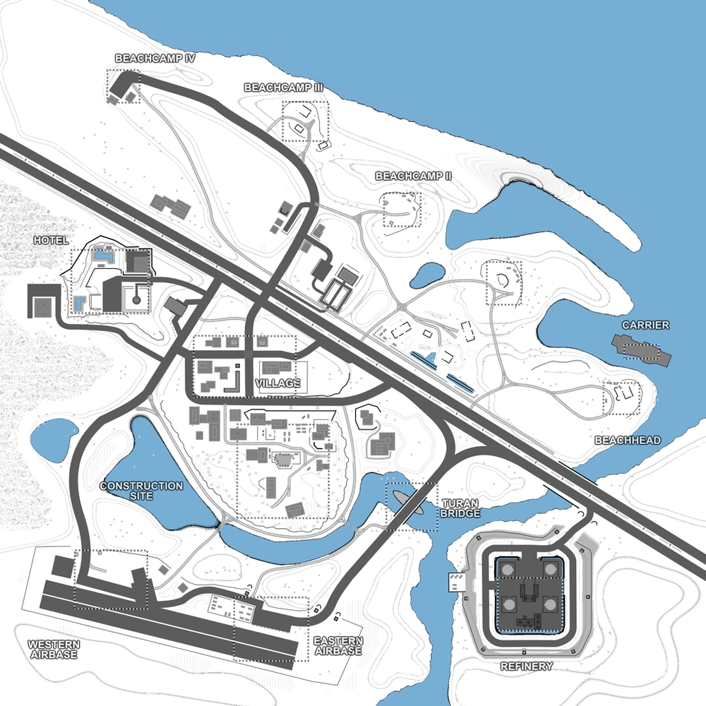

# Black Gold Estuary (map9)

Bases to capture	13

**Black Gold Estuary** is a bigger desert theme assault map, where one team starts with 2 bases (Carrier and Beachhead) while the other faction defends their 11 bases from the invaders. 

This map is relatively vehicle-intense and non-linear. The areas between the beach camps don't offer much cover, so that the assaulter need to advance with care.

:::info

The map has a strong resemblance of the Battlefield 2 map Gulf of Oman.

Individual locations: Carrier, Beachhead, Beach Camp I, Beach Camp II, Beach Camp III, Beach Camp IV, Hotel, Village, Construction Site, Turan Bridge, Eastern Airfield, Western Airfield, Refinery.

Vehicles available: Jeeps, Quads, Humvee, APCs, Transport Trucks, Armory Truck, Spawn Truck, Cargo Truck, Tanks, Rubber Boats, Patrol Ship, Cargo Vehicle

:::