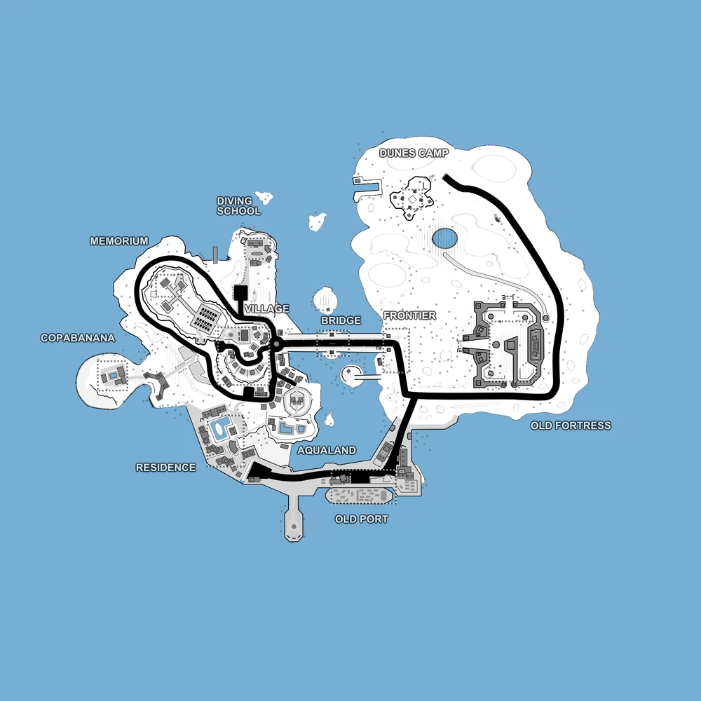

# Bootleg Islands (map5)

Bases to capture	11

**Bootleg Islands** is an interesting map surrounded by water which can lead to boat ambushes, with a chokepoints like Old Fortress, Bridge and the Old Port.

The map is divided into 3 parts: 
- a desert area in the East, 
- an urban area on the West 
- two long bridges connecting the two main islands.

Zones like Old Fortress, Diving School and Copabanana are good places for stealthy players that have silenced guns, however Bridge, Village and Old Port are great combat areas.

:::info
The map can be played with 2 factions but it's most suitable for 3 factions (like in the Campaign/invasion).

Individual locations: Diving School, Frontier, Dunes Camp, Old Fortress, Old Port, Aqualand, Copabanana, Village, Memorium, Residence, Bridge

Vehicles available: Jeeps, Quad, Spawn Trucks, Transport Truck, Cargo Trucks, Patrol Ships, Rubber Boats
:::