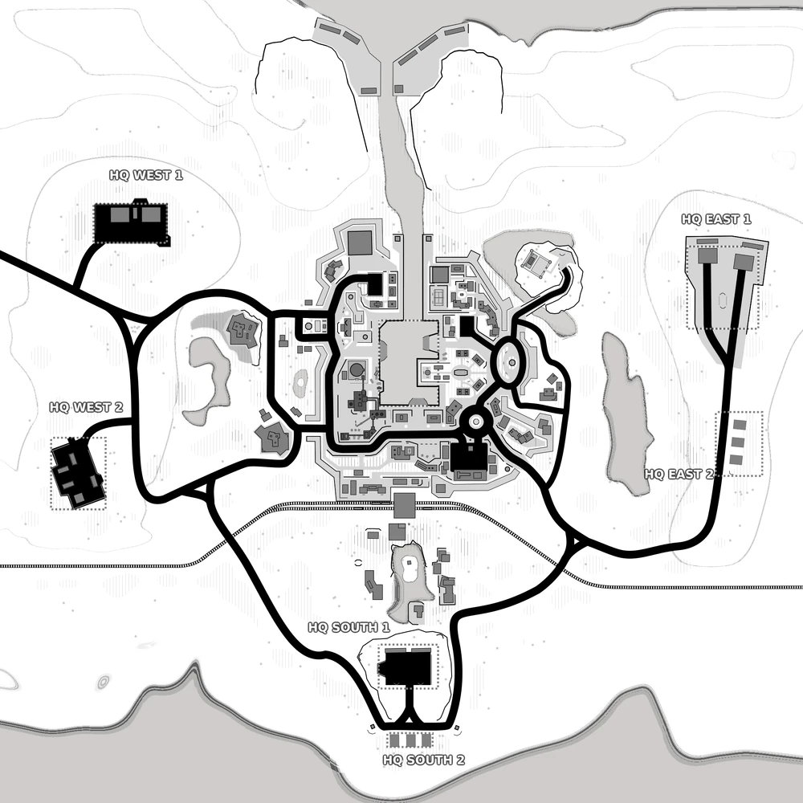

# Dry Enclave (map13_2)

Bases to capture	1

**Dry Enclave** is a three-faction king-of-the-hill version of Iron Enclave. The central water feature of Iron Enclave has been replaced with a Radar Tower, fixed defenses, and a light garrison of unaligned soldiers.

Many of the map features of Iron Enclave (armories, stashes) remain, even if not labelled on your map.

:::info

Individual locations: HQ West 1, HQ West 2, HQ South 1, HQ South 2, HQ East 1, HQ East 2

Vehicles available: Jeeps, Quad, Buggy, Humvees, Spawn trucks, Armory truck, APCs, Tanks, Legion, Noxe Ghost

:::