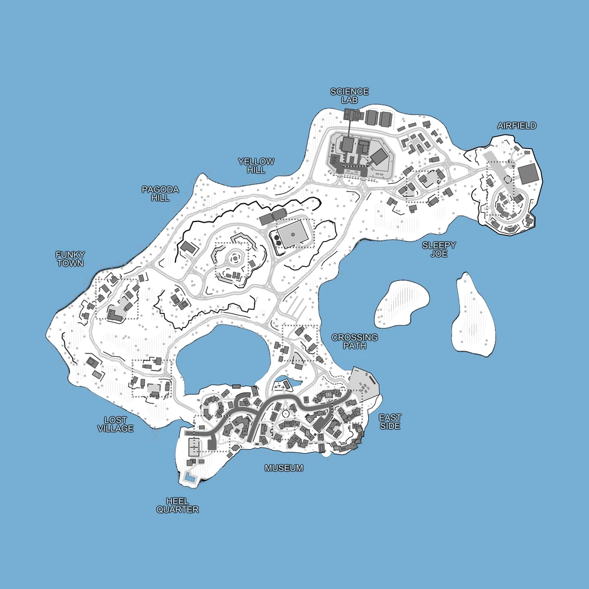

# Gotcha Island (map17)

Bases to capture	11

**Gotcha Island**is a converted map from Saipan, originally coming from the RWR: PACIFIC campaign. Gotcha Island has 11 capture locations.

:::info

there's an AA emplacement that must be destroyed in order to allow air-dropped support calls for the player's faction.

Individual locations: Airfield, Sleepy Joe, Science Lab, Yellow Hill, Pagoda Hill, Funky Town, Lost Village, Heel Quarter, Museum, East Side, Crossing Path
:::