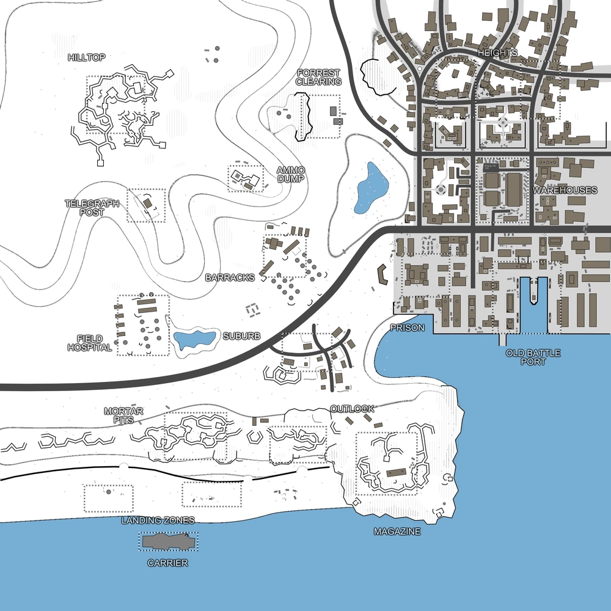

# Green Coast (map16)

Bases to capture	17

**Green Coast** is a 3 faction map that was added by the 1.71 update. It's a map converted from Operation Downfall, originally coming from RWR: PACIFIC.

:::info

there's an AA emplacement that must be destroyed in order to allow air-dropped support calls for the player's faction.

Individual locations: Carrier, Landing Zones, Mortar Pits, Outlook, Magazine, Suburb, Field Hospital, Barracks, Telegraph Post, Ammo Dump, Forrest Clearing, Hilltop, Prison, Old Battle Port, Warehouses, Heights
:::