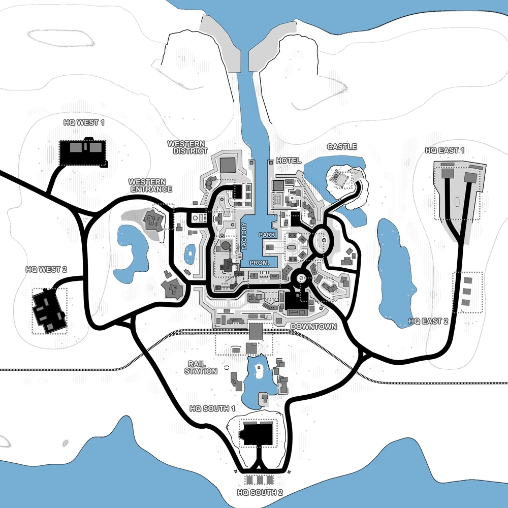

# Iron Enclave (map13)

Bases to capture	15

**Iron Enclave** is a three-faction map that was implemented with the 1.4 release. 

It comes with 15 different capture locations and it has a main city surrounded by the factions' headquarters.

The map is somewhat similar to Moorland Trenches regarding to the location of most of the bases.

:::info

Individual locations: HQ West 1, HQ West 2, HQ South 1, HQ South 2, HQ East 1, HQ East 2, Western District, Western Entrance, Factory, Rail Station, Promenade, Downtown, Park, Hotel, Castle, Port

Vehicles available: Jeeps, Quad, Buggy, Humvees, Spawn trucks, Armory truck, APCs, Tanks, Patrol Ship

:::