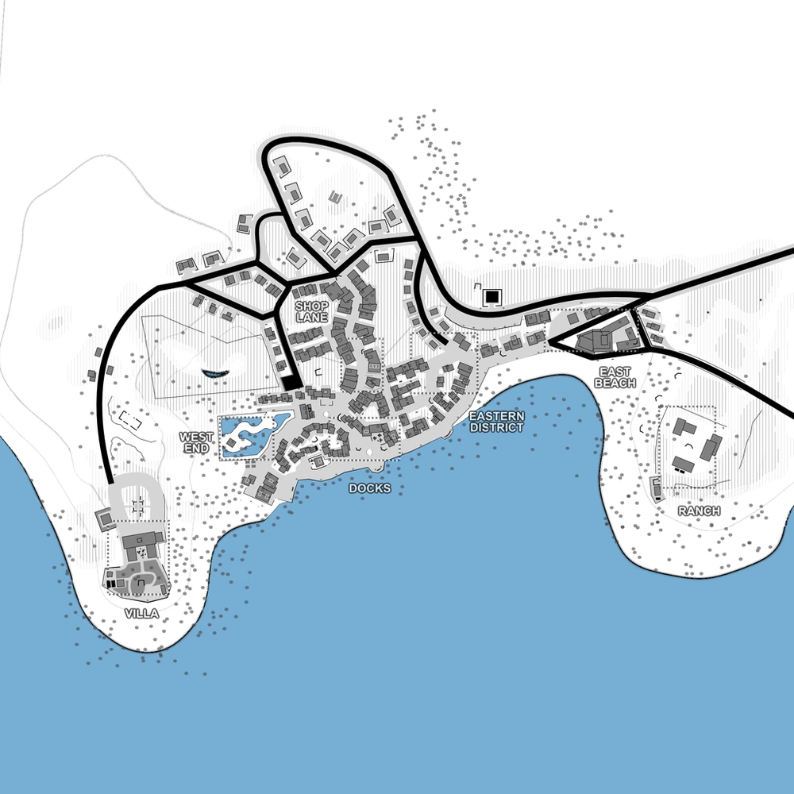

# Keepsake Bay (map2)

Bases to capture	8

Keepsake Bay is a seemingly urban area with 8 locations to capture. Some coastal points can be either attacked from land or with the use of boats and can be infiltrate by silencers, snipers or just marines driving boats. Rooftops provide a great place for stealthy players or snipers. The north of the map can be used for ambushes or different tactics as it is cut away from the urban zone.

:::info
This map is meant to be played with 2 factions

Individual locations: Villa, West End, Docks, Shop Lane, Eastern District, Church, East Beach, Ranch

Vehicles available: APCs, Spawn Trucks, Transport Truck, Comms trucks, Jeeps, Tank, Rubber Boats.
:::