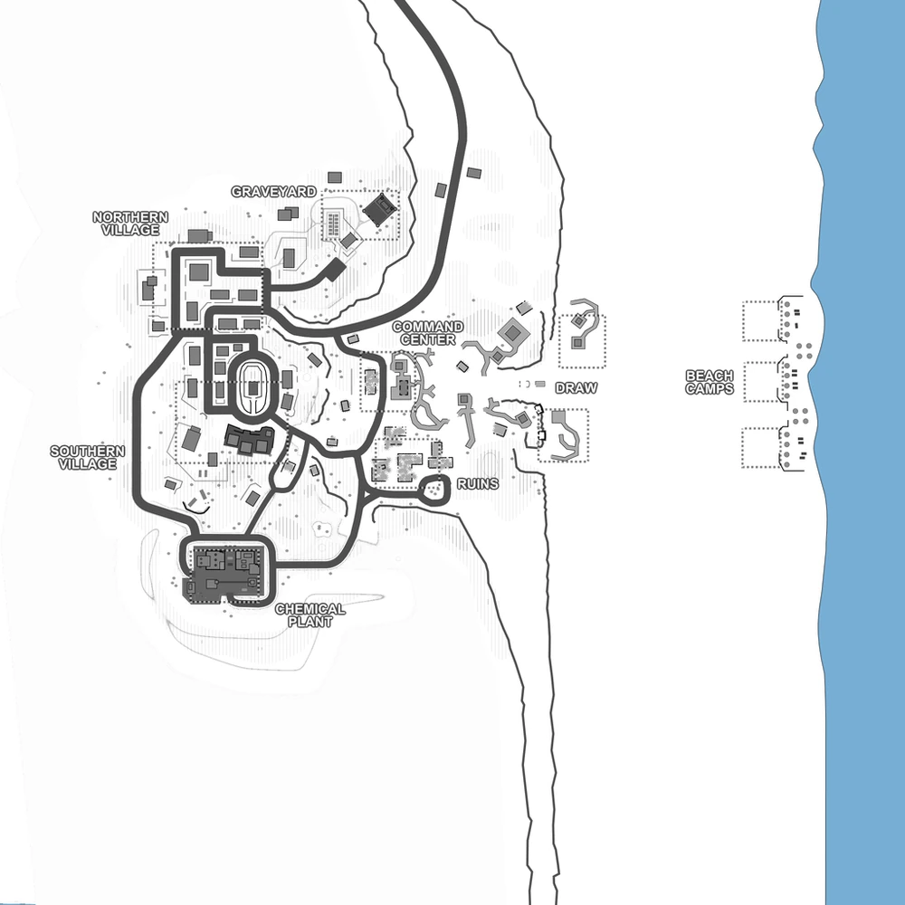

# Misty Heights (map14)

Bases to capture 8

**Misty Heights** is a coastal theme assault map, where the assault team starts with 3 beach bases while the other faction defends their 8 bases from the invaders.

:::info

It can only host 2 faction matches.

there's an AA emplacement that must be destroyed in order to allow air-dropped support calls for the player's faction.

Individual locations: Beach Camp North, Beach Camp Mid, Beach Camp South, Northern Draw, Southern Draw, Commander Center, Ruins, Chemical Plant, Southern Village, Northern Village, Graveyard

Vehicles available: Quad, Jeeps, Transport Trucks, Spawn truck, Armory Truck, APC, Tank, Mortar tank, Rubber Boats, Patrol Ship, Prison Bus

:::