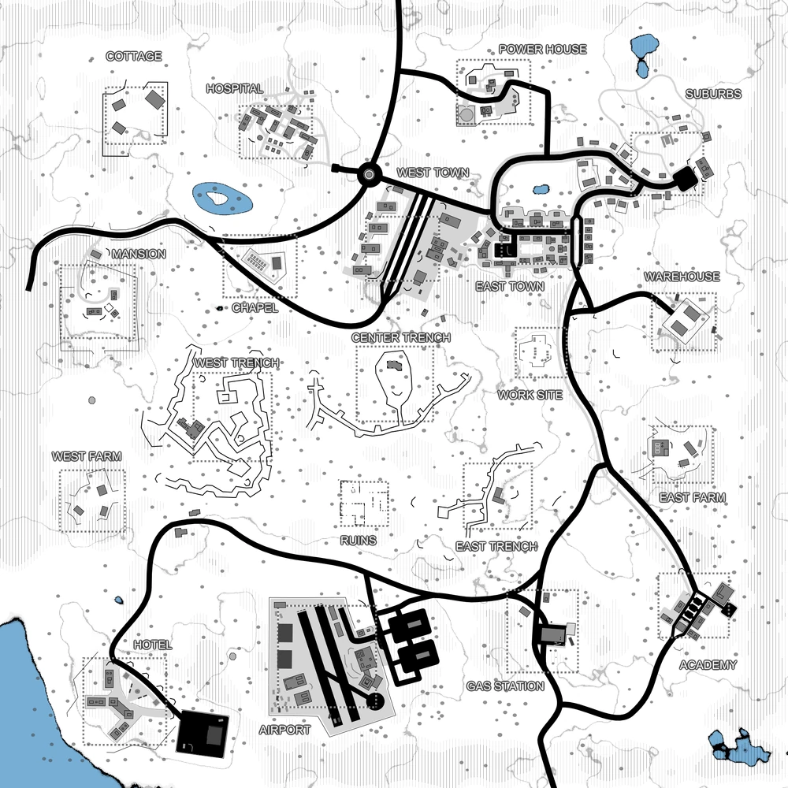

# Moorland Apocalypse (map1_2)

Bases to capture	20

Moorland Apocalypse is a variation and expansion of Moorland Trenches. The most immediate change is the map starts with the player faction surrounded in Center Trench. One faction controls all areas next to center trench, while the third faction controls the outer ring of bases.

Bringing valuables onto this map before claiming a second base is not recommended. Enemies can get into shooting range of some player spawns in the time it takes players to load the map. Additionally, Center Trench is a difficult base to defend from all sides. It is a common practice to race towards Cottage with the Armory Truck and Spawn Truck as soon as the map starts, a gambit that is not always effective, and rarely without danger.

However, that technique turns the map into something closer to the less lethal Moorland Trenches.

:::info
there's an AA emplacement that must be destroyed in order to allow air-dropped support calls for the player's faction.

Individual locations:Cottage, Hospital, Power House, Suburbs, Mansion, Chapel, West Town, East Town, West Farm, West Trench, Center Trench, Work Site, Warehouse, Ruins, East Trench, East Farm, Hotel, Airport, Gas Station, Academy

Vehicles available: Jeeps, Quads, Spawn Trucks, Armory Truck, Transport Trucks, Cargo Trucks, Vulcan tank, Tanks, Prison Buses, Cargo Vehicle, Legion
:::