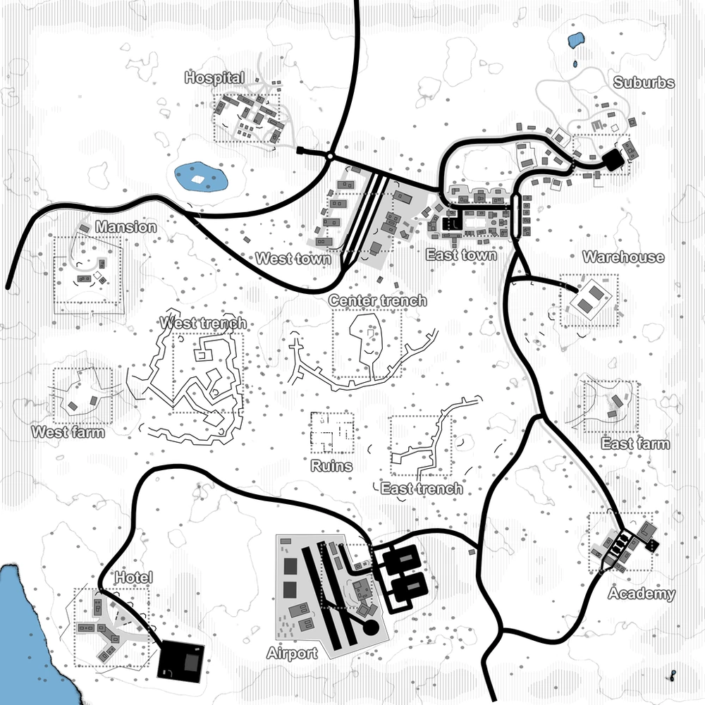

# Moorland Trenches (map1)

Bases to capture	15

Moorland Trenches was the first map that was released with the game. It comes with 15 different capture locations and spawn-zones, trenches in the middle and several buildings and towns. One of the largest maps in the game. It can be played with 2 factions but it's more suitable to be played with 3 factions (like in Campaign and Invasion).

:::info
there's an AA emplacement that must be destroyed in order to allow air-dropped support calls for the player's faction.

Individual locations: Hospital, Mansion, Suburbs, West Farm, West Trench, East Trench, Center Trench, Ruins, West Town, East Town, Warehouse, Academy, East Farm, Hotel, Airport

Vehicles available: Jeeps, Quads, Spawn Trucks, Armory Truck, Transport Trucks, Cargo Trucks, Vulcan tank, Tanks, Prison Buses, Cargo Vehicle
:::