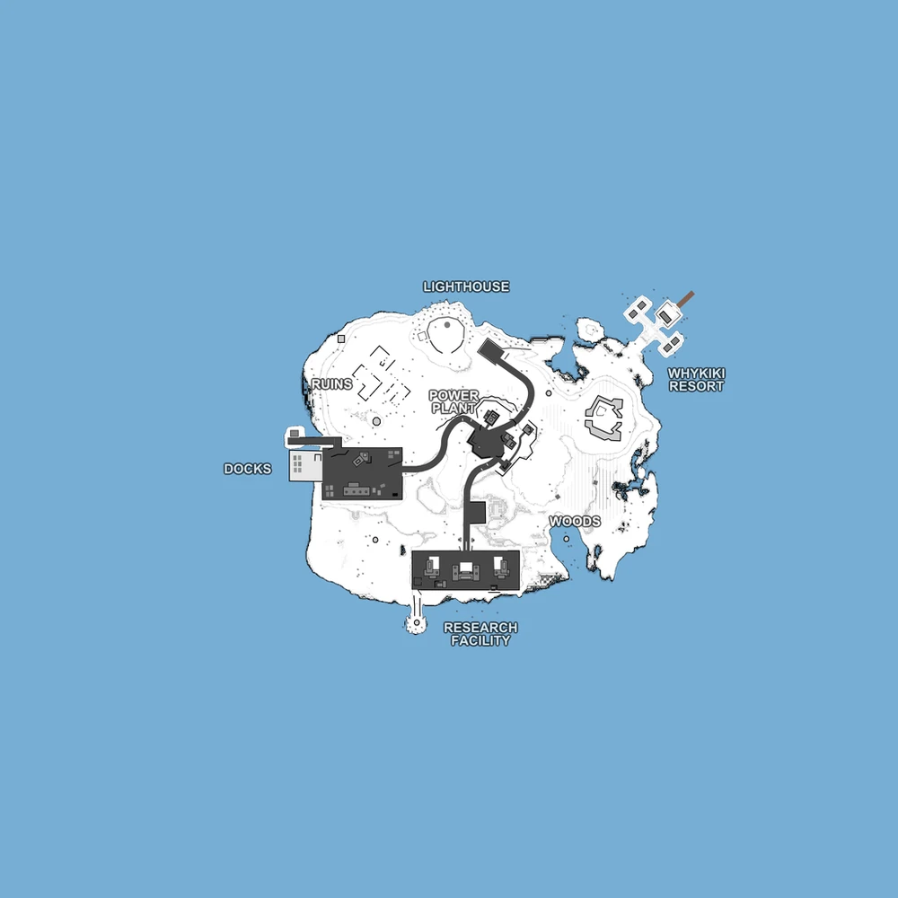

# Power Junction (map7)

Bases to capture	1

**Power Junction** is a relatively small island map which is played as king of the hill mode, where you have to capture the power plant and hold it for 400 seconds. The map features 2 starting bases for each faction and the power plant which starts as a neutral, empty location. To slow down the enemy flow you might want to try to infiltrate the enemy base to sabotage their radar tower. Also notice that the power plant is the only base that can be captured.

:::info

Artillery Calls (but not airstrikes, mortars, or gun runs) are unavailable.

It can only host 3 faction matches.

Individual locations: Docks, Ruins, Lighthouse, Whykiki Resort, Woods, Research Facility, Power Plant.

Vehicles available: Jeep, Rubber Boats
:::