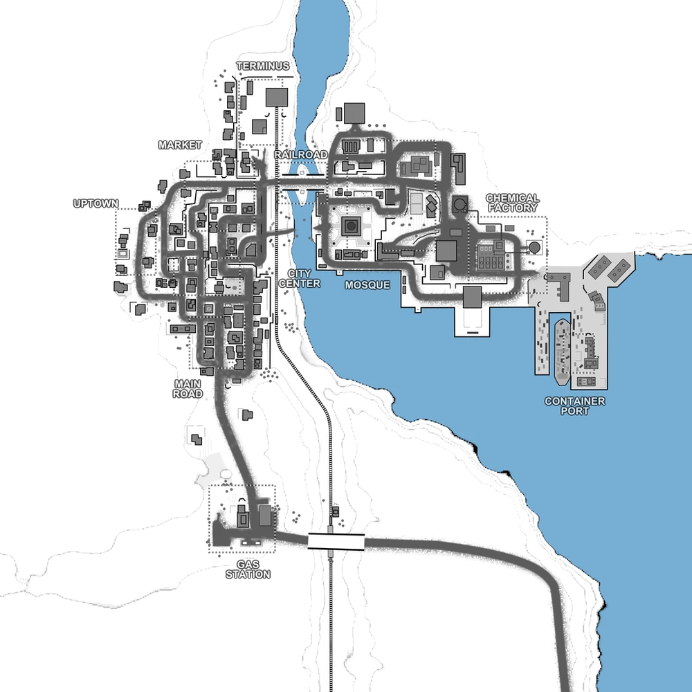

# Railroad Gap (map10)

Bases to capture	10

**Railroad Gap** is a desert theme assault map, with an urban elements, where one faction starts with 1 base while the other team defends their 9 bases from the invaders. The first part of the map is close quarter combat intense. Combat vehicles start to lose their effectiveness in the tight roads of the urban area where they can be easily flanked.

:::info

It can only host 2 faction matches.

there's an AA emplacement that must be destroyed in order to allow air-dropped support calls for the player's faction.

The map has a strong resemblance of the Battlefield 2 map Strike at Karkand.

Individual locations: Gas Station, Main Road, City Center, Market, Uptown, Terminus, Railroad, Mosque, Chemical Factory, Container Port.

Vehicles available: Jeeps, Quad, APC, Transport Trucks, Spawn Truck, Armory Truck, Cargo Truck, Vulcan Tank,

:::