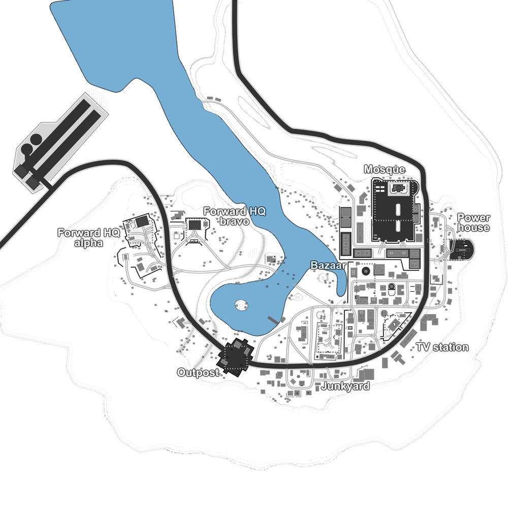

# Rattlesnake Crescent (map6)

Bases to capture	8

**Rattlesnake Crescent** is a desert theme assault map, where one team starts with 2 military bases while the other team defends their 6 bases from the invader. This map is relatively vehicle intense. Combat vehicles start to lose their effectiveness in the tight roads of the urban area where they can be easily flanked.

:::info
It can only host 2 faction matches.

there's an AA emplacement that must be destroyed in order to allow air-dropped support calls for the player's faction.

The map has a strong resemblance of the Battlefield 2 map Road to Jalalabad.

Individual locations: Forward HQ Alpha, Forward HQ Bravo, Outpost, Junkyard, TV Station, Bazaar, Power House, Mosque

Vehicles available: APCs, Jeeps, Quad, Buggy, Transport Trucks, Spawn Truck, Armory Truck, Comms Truck, Mortar Tank, Tanks, Rubber Boats
:::