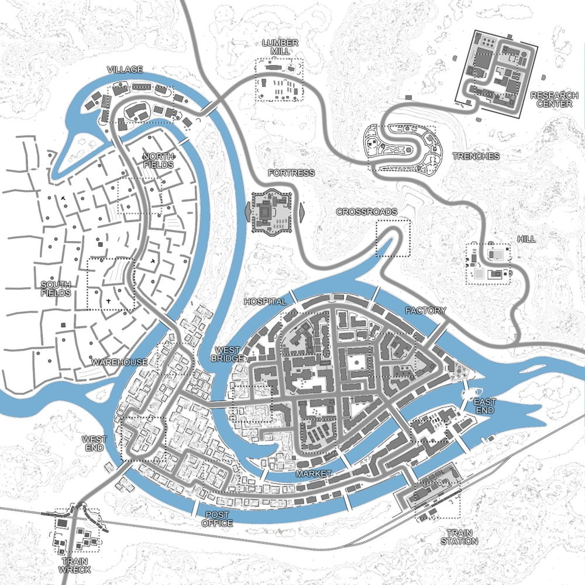

# Swan River (map19)

Bases to capture	19

**Swan River** is originally based on a community map developed by a workshop modder named Trudin. Swan River was added in the 1.94 update after an agreement that the Running with Rifles developers can adapt it to be included among many various gamemodes. The original map was designed to be played with the Edelweiss DLC, so a conversion for Vanilla was needed. Not only that but the decision was also made to make Swan River available in Vanilla Invasion/WW2 Invasion and Dominance PvP by the developers.[1]

However, Swan River noticeably lacks in both Armories and Stashes and since the map is quite big, players will need to plan accordingly when playing Swan River.

#### Trivia

Swan River is the first community map to be added to added as an official Vanilla/WW2 map.

The rivers outline a swan as the name of the map suggests.

:::info

Note: There's an AA emplacement that must be destroyed in order to allow air-dropped calls for the player's faction.

Individual locations: Train Wreck, Post Office, Train Station, West End, Market, East End, Warehouse, West Bridge, Hospital, Factory, South Field, Crossroads, Hill, North Fields, Fortress, Trenches, Village, Lumber Mill, Research Center

Vehicles available: TBA

:::