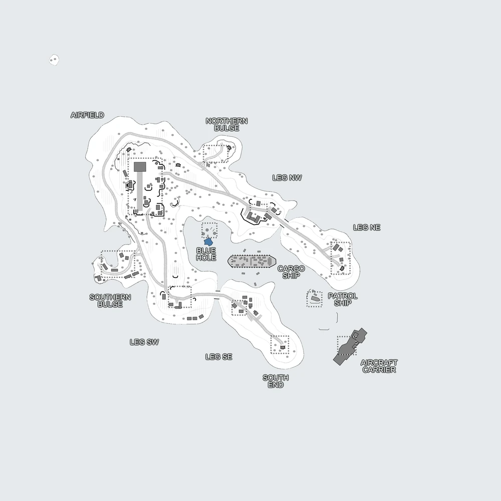

# Tropical Blizzard (map8_2)

Bases to capture	12

Based upon Vigil Island, this frozen wasteland forgoes (almost) all water in favor of open land warfare.

:::info

Beware the stranded Patrol Boat, for its missiles are far reaching and numerous. And it is protected by a Radar Tower.

Vehicles available: Jeeps, Quads, Transport Trucks, Spawn Truck, Armory Truck, APC, Mustella, Patrol Boat (stranded)

Mortar strike (1x8), Artillery strike (2x16) and (5x16) are the only calls that are available on this map.
:::