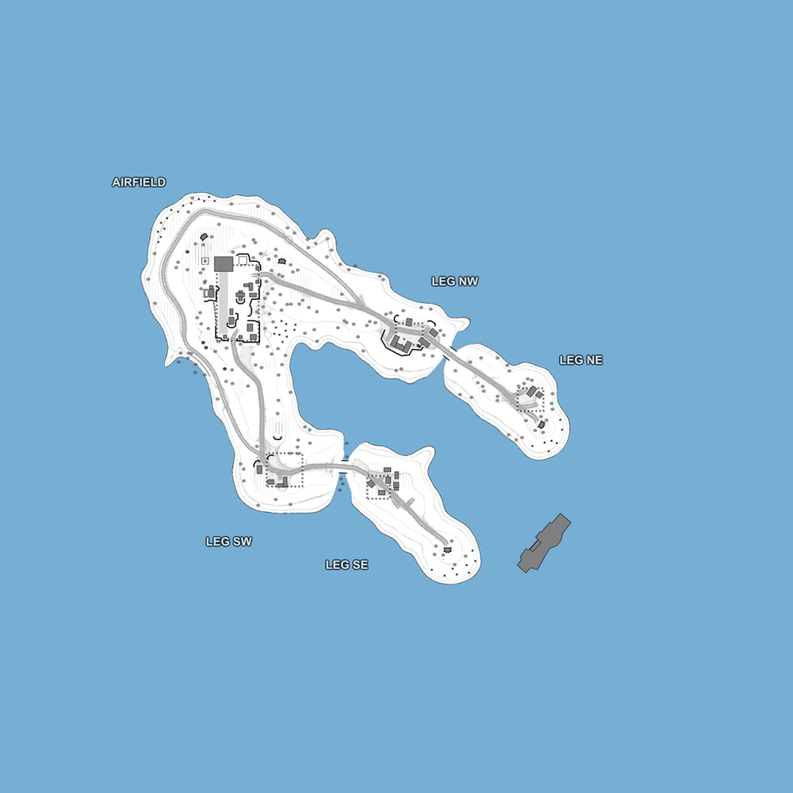

# Vigil Island (map8)

Bases to capture	1

**Vigil Island** is an island map which is played as king of the hill mode, where you have to capture the Airfield and hold it for 800 seconds. The map features 2 starting bases for each faction and the airfield which starts as a neutral, empty location.

:::info

It can only host 2 faction matches.

This map's name and layout are references to the Battle of Wake Island and its appearances in the Battlefield series of first-person shooters.

Individual locations: Airfield, Leg SW, Leg SE, Leg NW, Leg NE.

Vehicles available: Jeeps, Quads, Transport Trucks, Spawn Truck, Armory Truck, APC, Tanks, Rubber Boats
:::