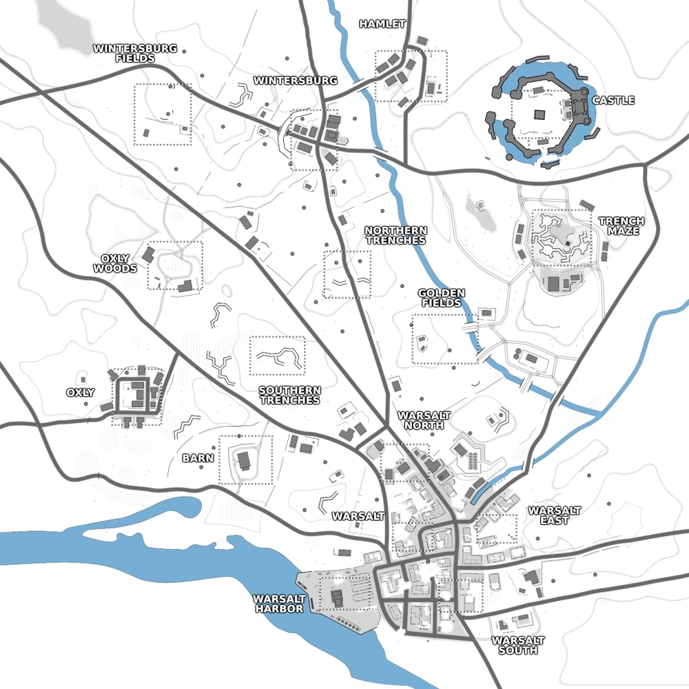

# Warsalt Legacy (map18)

Bases to capture	16

**Warsalt Legacy** is a map that was added in by the 1.91 update. It's a map converted from Operation Varsity originally coming from RWR: EDELWEISS. Since update 1.92, Warsalt Legacy now has additionally a southern entrance to the castle.

:::info

there's an AA emplacement that must be destroyed in order to allow air-dropped support calls for the player's faction.

Individual locations: Wintersburg Fields, Wintersburg, Hamlet, Castle, Oxly Woods, Northern Trenches, Trench Maze, Southern Trenches, Oxly, Golden Fields, Barn, Warsalt North, Warsalt South, Warsalt East, Warsalt Harbour, Warsalt

Vehicles available: Trucks, Quad, Supply Quad, Jeeps, Spawn Truck, Prison Bus, Armory Truck, Cargo Truck, APC, Tank
:::