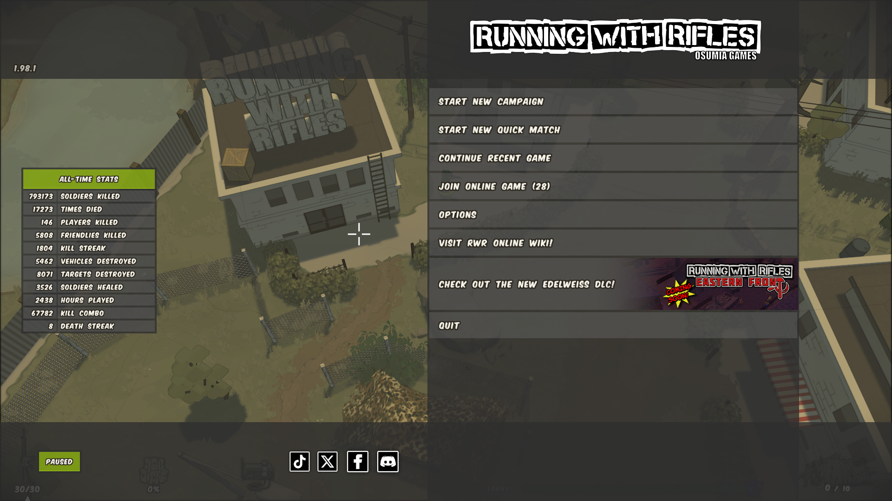
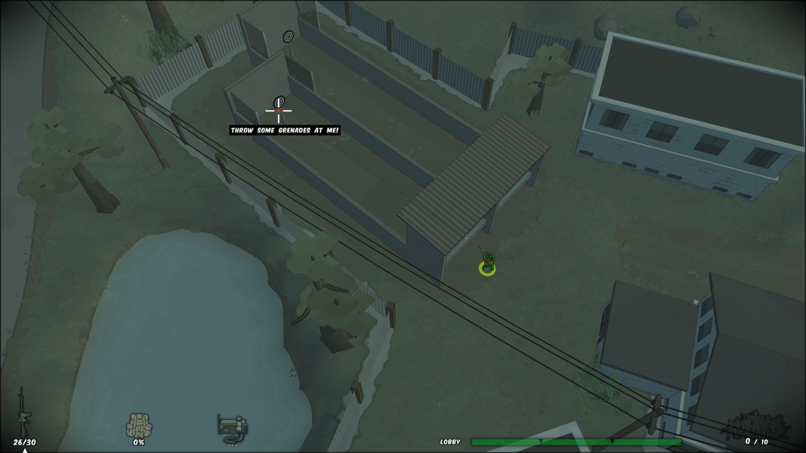
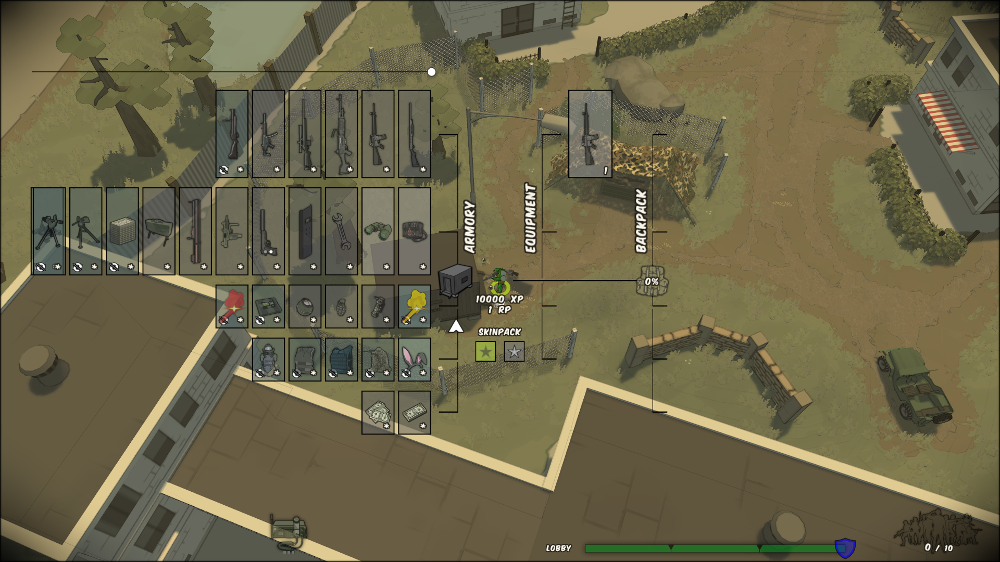

When you start up the game, you will find yourself in the lobby/playground area, which is basically a small map without any enemies. You can toggle the menu on and off with the ESC key. Doing so will allow you to use The Playground, which contains some basic tips and allows you to familiarize yourself with the way the game works. To start/resume a quick game/campaign, you need to have the menu opened (ESC).

The lobby has a stash and an armory that you can interact with. There is also a jeep that you can drive. On the top of the main building there are 2 crates. You may want to climb the ladder and smash the crates with your knife (default key "V") and pick up the items inside. Note that you are only a private (see Ranks) so that you might not be able to pick everything up (default key "F") directly as they are rank restricted. So when you are near those grayed out objects, hold the F-key to open your inventory and drag and drop this stuff into the backpack section of the inventory.

The Playground allows you to do some basic tasks that will allow you to gather some xp, which in turn will let you use more of the equipment found in the aforementioned crates and in the armory. You can also read some tips scattered around this area.

You can then go to the armory and sell your stuff. You may also want to go to the stash and pick up a valuable and sell it to the armory in the event that you need more resource points to buy equipment.

When you leave a campaign or a quick match, you will automatically come back to the lobby with the Playground loaded.