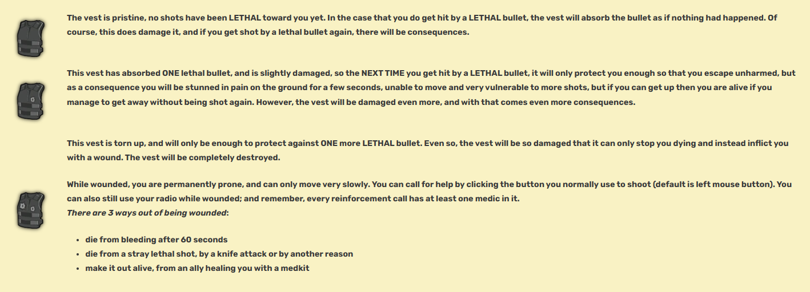

The health system in RWR is not the usual one most might be used to from many other shooters as you don't "take damage" in the traditional sense.
In fact, ***every bullet can kill*** at any moment. You don't have a health bar or any other indication that you've been hit for that matter (until you're dead, that is).
Every weapon has a different ***kill probability*** which is around 50% for assault rifles but can be up to 100% for some precise weapons like sniper rifles, e.g. if those hit you, you are dead.

However, there is an armor type item in-game that comes a bit closer to a health-point system - ***a vest*** (to be more specific, the Vest Type II is used in this example).

It gives you the ability to survive ***3 lethal shots***, each shot bringing its own consequences and damaging the vest. These vests can be bought at the Armory. Vests can also be worn by some AI soldiers - Vest Type II (hey, give them some fun too!) and by Elite soldiers (Officers) - Vest Type III. Vest Type III can be obtained by knifing enemy Elite soldiers (Officers) and the stabbed enemy will drop a vest down to 60% or can be found in a secret crates(unscathed). A vest icon is shown to the right of the grenade slot. 

In the table below those 3 stages of the vest status are listed below:

