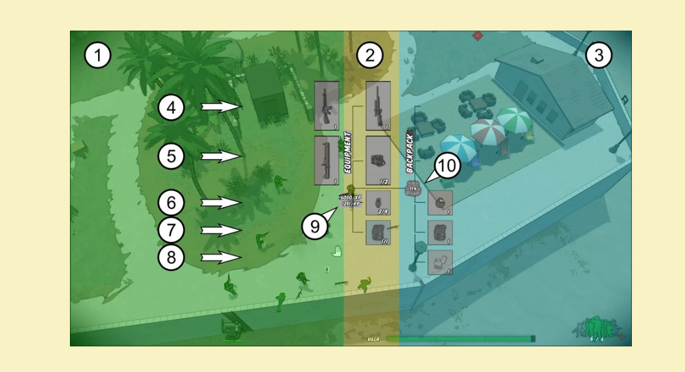
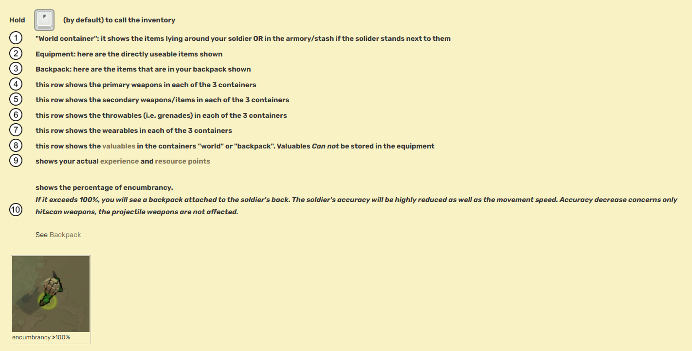

When you access the inventory, you will see a tree-like window centered on your soldier. It mainly consists of 3 containers, which have been highlighted in 3 different colors to make it easier to visualize.

To interact within the containers you can either ***drag & drop*** items from a container to another or ***press the mouse buttons.***

***LMB*** and the item will be equipped, no matter if it is in the world container or backpack.

***RMB*** on an object which is in your equipment into the backpack, ***RMB*** on an object which is in your backpack will move it into the world container (e.g. on the ground, stash or armory in case you are interacting with those).

***Holding Ctrl allows you to move a single item in/out of a stack.***

