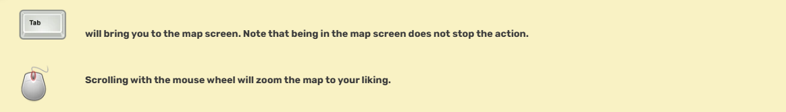
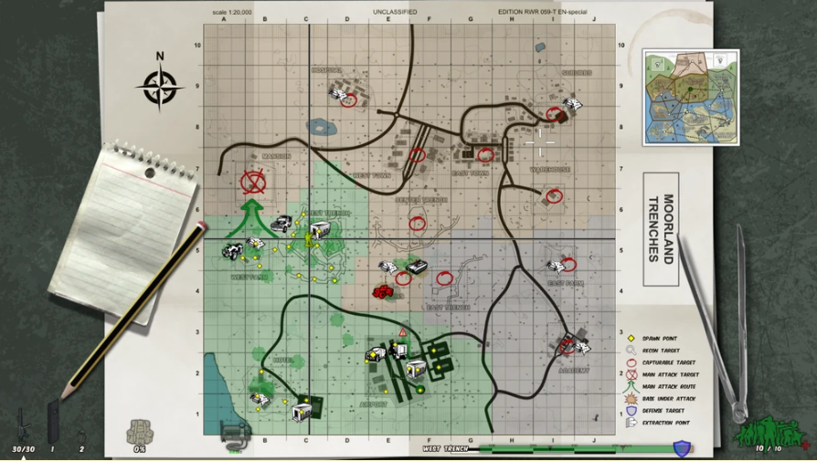
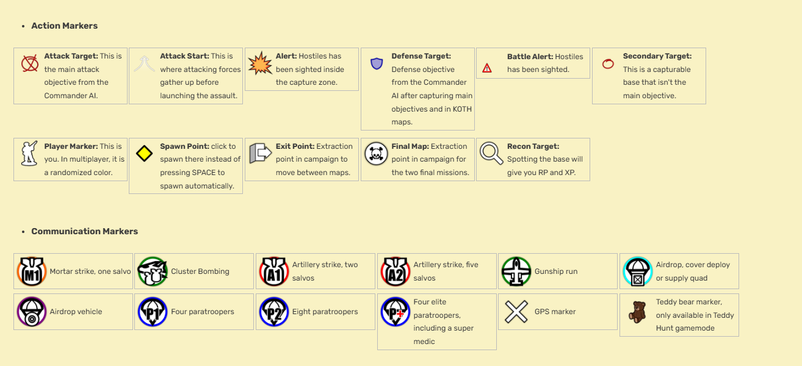
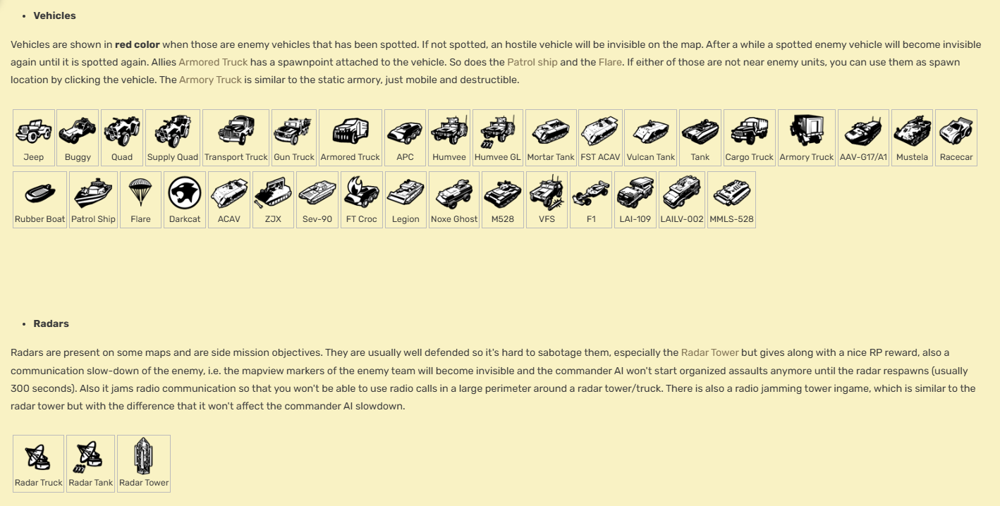
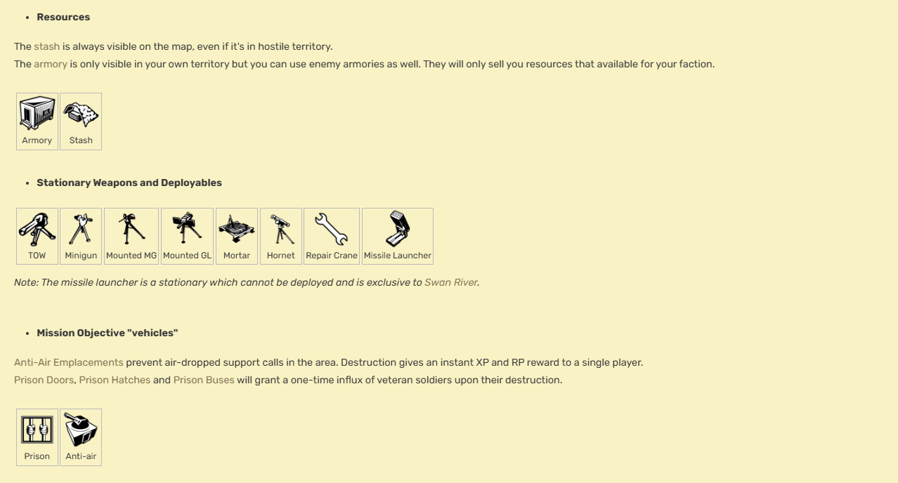

The mapview can be called by pressing the TAB key (default value). It gives you important informations about what territory is under your control and what base your commander AI is targeting. It also shows the different accessible spawn, vehicles and resources locations. It also shows the base names and those base are painted in the color of the faction which is under their control.

On the right hand side you have the name of the map (in this case Moorland Trenches) and on top of it a mini map of the worldview, which contains all maps for the campaign and a network which connected them together as you can't move from one map to another if those aren't linked together in the network. With WheelUP, WheelDOWN of your mouse, you can zoom in and out. With the Left Mouse Button keep pressed you can also pan through the mapview (if zoomed in).

Since version 0.96 the soldier repartition is represented by colored clouds. The darker those clouds the more soldiers are on the same location. Enemy clouds can only be seen in sectors in contact with your own one. Squads of your own faction can be seen over the whole map (the picture below is still from the old system where you saw small numbers in each populated square of the grid).

