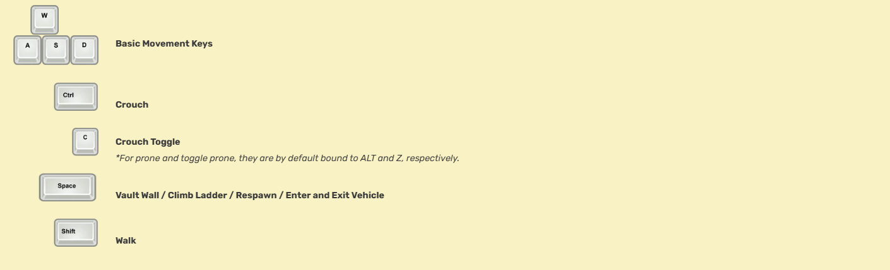
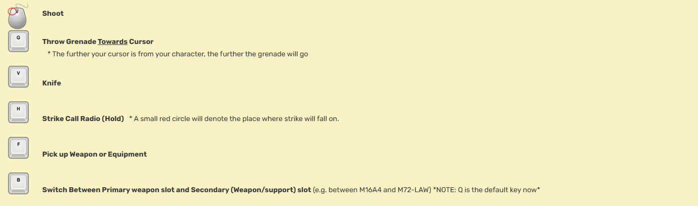

Congratulations! You are now smack dab in the middle of a fight. Now what? The first thing you should learn is how to navigate the open terrain and shoot those damn *insert other color here* soldiers. Please note that all of these key bindings are default. You can change them to your liking in the “Options” menu.

### Movement Key Bindings

The keys shown are the default controls, which can be re-bound. See the controls page for more.

### Shooting Key Bindings

The keys shown are the default controls, which can be re-bound. See the controls page for more.

