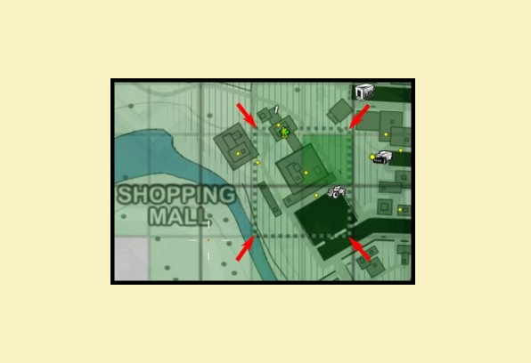

For most maps, the ultimate objective of RWR is to capture the entire map. This is done by capturing the sectors shown in the map. The sectors shaded by your faction's color belong to you already.

On King of the Hill type maps (Power Junction and Vigil Island), the objective is to capture the central base (which is a neutral zone at the beginning of the match) and hold it non-stop for the required amount of time. If the enemy faction take the "hill" back, the countdown timer will be reset.

## Capturing Sectors

Capturing sectors is achieved by having more than 66% of the total troop count in the capture zone as denoted by a dashed square on the map for each sector (see image "capture zone example" below). As a sector is being captured, a timer will count down from 10 to 0 with an audible beeping sound. However, the last sector of the map will take 30 seconds to capture rather than the standard 10. If the countdown timer is interrupted (you suddenly have less than 66% of the total troop count), the timer will stop and restart next time you get more than 66% again.

The 66% mark are denoted by a vertical stroke (see image "capture force example"). If the black square is outside those vertical stroke, then it means that there are more than 66% of the forces of a faction inside the capture zone. In the specific example below, we have around 80% of the troups being the Graycollars, so that the timer is ticking down (6 seconds left to go before the base is captured by the attacking faction)

***Capture zone example***

Since version 0.99.5 you can see the red target crosshair marker on top of your capture force bar when you are inside an enemy capture zone. On the other hand, you'll have a blue shield marker when you are inside an allied capture zone. This makes it easier for you to know if you are inside that zone than having to look at the map.

***Capture force example***

## Capture base reward

Capturing a base gives an RP reward to every soldier inside that zone depending on how much time the base was under enemy control. If the base was under enemy control for 1 minute or less, 0 RP is rewarded. If the base was under enemy control for 10 minutes or more, 150 RP is rewarded. If the base was under enemy control for between 1 and 10 minutes, the RP reward is scaled linearly between 0 and 150, For example, you'll receive 60 RP for capturing a base that was under enemy control for 4 minutes, 120 for 8 minutes, etc.

## Side Missions
Capturing bases can be tough. There are a few, optional missions you can attempt on the side to help even the odds...

### Seek

Be the eyes of your faction, perched up on rooftops or hidden deep in enemy territory. Spot vehicles and structures that will appear on the map for your whole team. Also gives a certain amount of RP.

### Destroy

These targets of opportunity provide strategic abilities to the owning faction, and gives a certain XP and RP awards when destroyed:

- Radio Jammers

- Radar Towers

- Comms Truck

- Anti-Air Emplacements

- Mortar Ammunitions

- Miscellaneous structures (fuel tanks, water towers)

### Rescue

Targets that will grant a one-time influx of 20 prisoners of your faction as a extra units upon their destruction:

- Prison Door

- Prison Buses

- Prison Hatches

### Retrieve

- stealing and delivering cargo trucks unlocks an extra weapons or equipment

- sell these items to an armory to improve your faction's arsenal:
  - briefcases and laptops, most commonly dropped by Elite soldiers (Officers)

- enemy's stock weapons
  - to unlock an enemy stock weapon for your own faction, bring five pieces of a particular model to an armory

The unlocked weapons ends of stock after 4 hours. To re-unlock them you must repeat the same procedure.