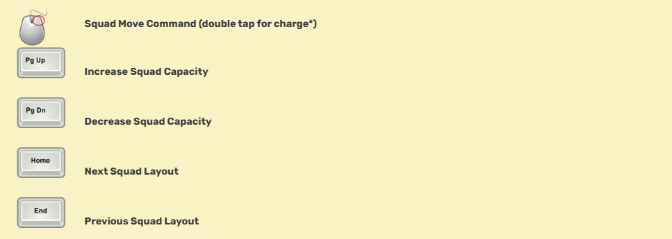
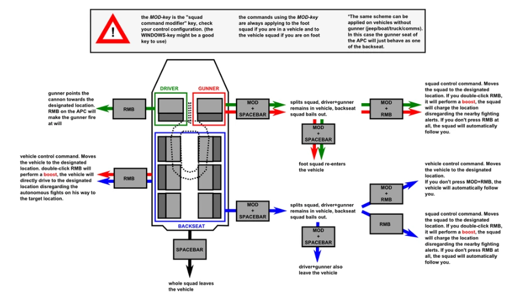
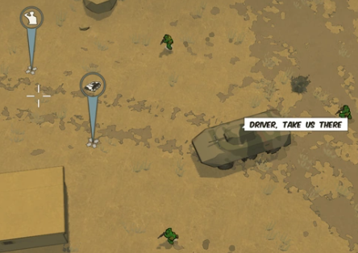

When your character is of sufficient rank, ***squadmates*** will begin to follow you around. Soldiers of lower rank will automatically join your ***squad***.

Members of your squad will have small grey indicators under their feet and will stay within a certain distance of you. By default they will follow you, but clicking the right mouse button (***RMB***) will order them to specific places. By double clicking RMB you can order squadmates to ***charge*** a position without taking cover.

A higher ranked officer nearby may "steal" soldiers from your squad to fill out his own squad. The size of your squad is determined by your XP: you can have one squadmate for every thousand XP, up to ten. Squad size does not correlate with rank.


## Controls




## Vehicles

Squad members will attempt to enter any vehicle that you enter and will fill as many seats as possible. If, however, you are in the passenger seat of a vehicle and your squadmate is in the driver's seat, you can click RMB to command the driver to drive around the screen.

You can also open up the Map and click RMB on the Map to set waypoints further away. The driver AI will drive there, terribly, often running over other friendly troops.

Pressing PageDown will decrease your squad size. This can be useful when you want to sneak into an enemy base without being spotted, or if you just want to be a lone wolf. Pressing the PageUp key will increase the squad size to the max size a soldier of your rank can support.

## Splitting the squad

Being the squad leader you can also ***split the squad*** into a vehicle sub-squad (which handles the vehicle and the mounted weapons) and a foot squad which will provide infantry support.

You need a modification key (***MOD***) bound to use these commands. The default is Windows key.



### Example



In this example, the player hopped into the APC as gunner. All the squad members jumped into the vehicle as well. The driver seat has the highest priority, then gunner slots, then passengers.
The player first pressed "Windows+spacebar" to make the other sub-squad bail out, which in this case are the backseat soldiers.

Then, they clicked the "right mouse button" on the location where the APC Marker is, which will make the driver move the APC to that marker. Lastly, they clicked "Windows+Right mouse button" at the location where the Squad marker is, and the sub-squad on foot outside the APC will move there.

## Squad layout

The ***squad layout*** represents the kind of soldiers you want in your squad. For example, the "Default Squad" layout will try to pick up first a soldier with a medikit on him and the other squad members are chosen randomly.

### Editing squad layout

Squad files are anything of extension ***.squad_config*** in \media\packages\vanilla\factions. They are in an XML format, which is beyond the scope of this document; for basics, try this tutorial. Skip down to "structural elements" if you don't want to read the history of XML and HTML.

This XML header should be the first thing in the file. We can probably put multiple squad definitions in a file.

```xml
<?xml version="1.0" encoding="utf-8"?>
```
Squad config: Replace NAME with the in-game name you want to see. It should probably not have any spaces or be very long.

```xml
<squad_config name="NAME">
```
Soldier tags indicate preferences (or possibly requirements?). This tag will accept any soldier.

```xml
<soldier />
```
This tag dictates that the soldier should have a machine gun and a bazooka. It is unknown if the order of tags matters, or if a soldier cannot be found, the rest of the squad will not fill out.

```xml
<soldier weapon1_tag="machine gun"	weapon2_tag="bazooka" />
```
Valid values for weapon1_tag are

- cqb - shotguns
- sniper - sniper rifles
- machine gun - heavy machine guns such as the PKM and m240
- assault - assault rifles, and grenade launchers

 Valid values for weapon2_tag are

- medikit - health kit
- bazooka - any rocket launcher
- engineer - minigun, machinegn, tank trap (currently disabled), deployable cover
- mortar - portable mortar

Each weapon is tagged in its .weapon file in \media\packages\vanilla\weapons.
```xml
<tag name="cqb" />
```
Note that while

```xml
stealth
```

is a valid tag for both fields, it's useless because AI will not use silent weapons!

:::note
After 3 hours of testing, it is possible that by using another string

```xml
carry_item
```
you may be able to add soldiers wearing vests or carrying valuables into your squad while excluding normal soldiers. This may allow the formation of an all-elite squad or a suicidal farming squad. More testing is needed but such a development may provide users with the ability to form more powerful squad layouts.


Alternatively from the format above, you can also use

```xml
weapon1_key or weapon2_key or carry_item_key
```
to specify a specific weapon for the selected soldier's loadout. It is also important to keep in mind that while doing so allows you to more fimly control your squad layout, it also becomes harder for you to locate soldiers with the exact weapon set depicted. It may also be possible to add elite soldiers to your squad by use of
```xml
<soldier name="miniboss"> or conversely a specified medic with <soldier name="medic>
```
more testing is needed.
:::