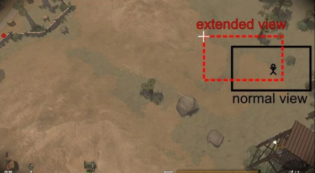
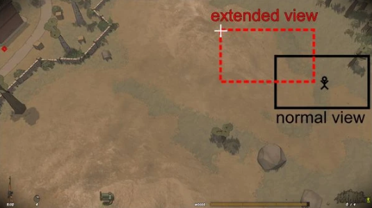

See also: Stealth In Running with Rifles, the field of view is different than in most other top-down shooters, as moving the cross-hair towards the edges of your screen increases your view distance in that direction by around 80% (for a default weapon without scope). On the other hand, you will have a sight disadvantage if someone attacks you from the opposite direction. The use of that sight advantage should be kept in mind as it gives you a noticeable advantage over the AI. This is even more important in PvP as the enemy player can also use extended cross-hair moving for early detection. It is not seldom that the player who detects the enemy first will be the winner of the duel.

Also in RWR you don't have a Fog of War so that you can see every enemy that is seen from your point of view, no matter if there is an object between you and the enemy. For the AI it is different, it behaves like it would have a line of sight occlusion, which means that if there is an object between you and the enemy, he won't be able to detect you.

## Sight range modifier
Depending on the weapon you are using, your extended view might have different values, which makes you see farther if you you use a sniper rifle compared to a conventional weapon without scope.

Here is a comparison between an AK47 (left image) and a SVD with scope (right image) taken from the same location. the AI also takes advantage of sight range modifier

## Detection range

In RWR, your stance has an impact on your visibility. If you are in the line of sight of an enemy, you will be harder to detect if you crouch or even harder if you go prone. Going prone and crouching affects not only detection range but also reaction time of enemy. Going prone has better concealment than crouch has. Distance between your soldier and enemy also affects reaction time of AI enemy. Shooting causes immediate detection against you if you are in dectection range of enemy.

Other factors are the day and night cycle as the overall visibility of the AI is reduced at night. Also, depending if a sector is alerted or not, the AI will have a different detection range. An alert happens when hostiles have been detected in a close distance either by sight or audibly.

Those factors are especially important, when you want to go stealth. A prone soldier with a silencer weapon, at night in a non-alerted location will be the hardest to detect.

## Spotting

Mousing over enemy vehicles and structures will mark them on the map for your faction. AI can only spot enemy-occupied vehicles, and only once conditions are met for detection. Spotting gives an instant XP and RP reward to a single player. Only human players can make use of this map information.